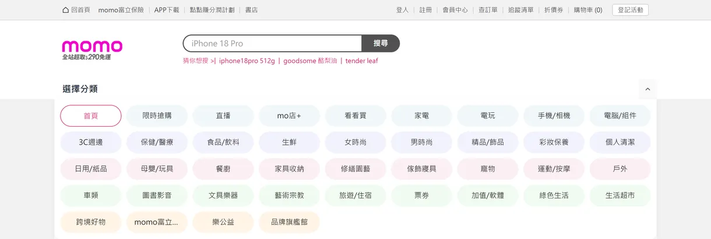

# momo-shop-work

[](https://github.com/zach0627/momo-shop-work/actions/workflows/ci.yml)

Mocking momoshop —— 以純前端重建 momo 電商的首頁與商品詳情頁。全程使用 Mock Data，不呼叫任何真實 API。

**Demo：<https://zach0627.github.io/momo-shop-work/>**（GitHub Pages；CI 通過後自動部署）

[](https://zach0627.github.io/momo-shop-work/)

<sub>首頁最上面：固定在頂端的頂部列、搜尋框與猜你想搜的關鍵字、可展開的分類列，以及一次露出 2.57 張的主要活動輪播與右側「今日大牌」。其餘畫面在下面的 [畫面](#畫面) 一節。</sub>

由一位工程師與 Claude Code 協作完成。這個 repo 想回答的不是「畫面像不像」，而是三個問題：**系統怎麼切、為什麼這樣切；和真實網站差在哪、為什麼；Human 怎麼監督 Agent、效率如何。** 每一個都有對應的文件，而且照實寫。

## 畫面

下面都是**這個專案**跑起來的畫面（[`docs/screenshots/`](./docs/screenshots)）；目標畫面（真實網站）的截圖在 [`docs/pictures/`](./docs/pictures)，兩邊可以對照著看。

截圖由 `pnpm capture:screenshots` 產生：對 build 出來的產物（`vite preview`）在 1440px 寬的視窗、2 倍像素截圖，再縮成 1220px 寬的 WebP。裁切範圍由頁面上的元素位置算出來（不寫死座標），而且**畫面上看得到的圖沒有全部載完、或還有載入中的佔位，就不截圖**、直接以錯誤結束 —— 避免放上半張圖的截圖。

### 官方優惠


圖示輪播、左邊 5 個捷徑與右邊 9 個熱搜排行（名次顏色、上升、新上榜），再接超大牌。三塊之間緊貼：區塊之間要不要留 16px 由版位資料決定，和真站量到的一致（[這次調整的設計與量測](./openspec/changes/archive/2026-09-20-match-official-deals/design.md)）。

### 降價好貨


一次 8.45 張的商品輪播，最後一張露出一半是真站的做法（提示還能往右捲）。每張卡片都可以點進詳情頁，卡片與詳情頁一定是同一件商品：版位資料只給 collection key，商品由商品目錄提供。

### 限時搶購


每秒更新的倒數（重新整理就重新計時）、限搶價、剩餘組數與「搶」標籤；每頁 2 × 5 件可以換頁。這一區有自己的邏輯，所以是一個 feature package。

### 你可能會喜歡


一次載入 3 列共 15 件，按「看更多」再載 3 列；載完之後按鈕會消失。載入中會先顯示和真卡片一樣高的佔位，商品到了版面不會跳動。

### 分類面板



分類列右側的按鈕展開後蓋住分類列，顯示 40 個分類。五列的底色是「第幾列」決定的，屬於版面，不在資料裡。

### 商品詳情頁


左邊主圖、右邊標題與條列說明、促銷價與市售價，下面三顆按鈕。**三顆按鈕刻意不綁任何行為**（需求明訂到此為止），而且有測試確保它們不會被順手接上購物車或結帳。

## 狀態：兩個頁面都已完成

| 路由              | 內容                                                                                                                                                                                                                                                                                    |
| ----------------- | --------------------------------------------------------------------------------------------------------------------------------------------------------------------------------------------------------------------------------------------------------------------------------------- |
| `/`               | 首頁，由版位資料驅動：15 筆設定、8 種區塊型別。主要活動、官方優惠、降價好貨、品牌折扣、旗艦名店、momo 店取、信用卡優惠、猜你想搜、**限時搶購**（每秒更新的倒數、每頁 2 × 5 件可換頁）、今日暢銷榜、moPro、**你可能會喜歡**（每次載入 3 列，載完後「看更多」消失）。商品卡都可點進詳情頁 |
| `/goods/:goodsId` | 商品詳情頁（**展示用**）：主圖、標題、條列說明、價格、三顆**刻意不綁行為**的按鈕；商品不存在時顯示提示與回首頁的連結                                                                                                                                                                    |
| 其他路徑          | 找不到頁面                                                                                                                                                                                                                                                                              |

三條路由都包在同一個 layout 裡：捲動後收合的頂部列、搜尋框、可展開的 40 個分類、footer。

沒做的、和真站不一樣的，全部列在 [Known Gaps](#known-gaps)。計畫裡的加分項也都做了：區塊層級的 error boundary、載入中的佔位（skeleton）、Playwright smoke test、靜態部署。實作進度逐項記在 [`tasks.md`](./openspec/changes/archive/2026-09-20-build-storefront-pages/tasks.md)：每一項都寫了怎麼驗證的、哪些沒驗到。

## 快速開始

```bash
pnpm install
pnpm nx dev shop                           # 開發伺服器 http://localhost:4200
```

```bash
pnpm nx run-many -t lint test typecheck    # 全部專案（10 個專案、184 個測試）
pnpm nx build shop
pnpm nx e2e shop                           # Playwright smoke：對 build 產物跑，用本機的 Edge（CI 用 Chrome），不用下載瀏覽器
pnpm format:check
pnpm verify:boundaries                     # 依賴規則真的套用到每個專案、依賴圖 0 違規
pnpm verify:fixtures                       # 商品 fixtures 與素材一致（過期時失敗）；重新產生用 pnpm gen:fixtures
pnpm nx graph                              # 看依賴圖
```

```bash
pnpm nx preview shop                       # build 產物 http://localhost:4300
pnpm capture:screenshots                   # 重新產生 README 的畫面截圖（需要上一行的網站跑著）
```

需要 Node `>=22.22.0`（React Router 8 的要求；本專案以 Node 24 開發，CI 也用 24）與 pnpm 12。`package.json` 的 `packageManager` 鎖定 `pnpm@12.4.2`，較舊的 pnpm 會自動切換到這個版本。行為規格用 [OpenSpec](https://github.com/Fission-AI/OpenSpec) 撰寫；裝了它的 CLI 才需要跑 `openspec validate --all --strict`。

## 先看這幾份

| 文件                                                                      | 內容                                                                                                                                                                                                                                                                                                                                                                                                      |
| ------------------------------------------------------------------------- | --------------------------------------------------------------------------------------------------------------------------------------------------------------------------------------------------------------------------------------------------------------------------------------------------------------------------------------------------------------------------------------------------------- |
| [`docs/architecture.md`](./docs/architecture.md)                          | 系統怎麼切、為什麼這樣切、規模變大時怎麼管                                                                                                                                                                                                                                                                                                                                                                |
| [`docs/adr/`](./docs/adr)                                                 | 8 個決策：背景、理由、**代價**、演進觸發條件                                                                                                                                                                                                                                                                                                                                                              |
| [`docs/agent-workflow.md`](./docs/agent-workflow.md)                      | Human ↔ Agent 怎麼協作；Human 糾正 Agent 13 次、Agent 出錯 39 件、偏離計畫 55 項的完整紀錄；**協作效率評估**                                                                                                                                                                                                                                                                                              |
| [`docs/design-tokens.md`](./docs/design-tokens.md)                        | 兩層 design token（Primitive / Semantic）；每個顏色、字級、框線的數值都是從真實網站的計算樣式**量出來的**，並記錄在哪裡量到、哪些沒量到                                                                                                                                                                                                                                                                   |
| [`openspec/specs/`](./openspec/specs)                                     | **行為規格**（OpenSpec 主規格，已全部實作）：app-layout、home-page、goods-detail、product-catalog、product-recommendation 五個頁面相關的能力，以及 image-delivery（GitHub Pages 展示用的圖片尺寸）；scenario 直接翻成測試。另有下一列的工程約束                                                                                                                                                           |
| [`openspec/changes/archive/`](./openspec/changes/archive)                 | 已歸檔的變更，各有 `proposal.md`（為什麼做）、`design.md`（設計決策與放棄的方案）、`tasks.md`（逐項的實作與驗證紀錄，含沒驗到的）：[`2026-09-20-build-storefront-pages`](./openspec/changes/archive/2026-09-20-build-storefront-pages) 建出這兩個頁面；[`2026-09-20-optimize-demo-images`](./openspec/changes/archive/2026-09-20-optimize-demo-images) 為了 GitHub Pages 上的展示把圖片縮到顯示尺寸的兩倍 |
| [`openspec/specs/module-boundaries/`](./openspec/specs/module-boundaries) | 工程約束的規格：依賴方向、框架耦合的單點放行、package 的公開入口、可重現的安裝。每一條「會被擋下」都放過違規樣本確認                                                                                                                                                                                                                                                                                      |
| [`openspec/config.yaml`](./openspec/config.yaml)                          | 專案脈絡（為什麼存在、為什麼這樣設置、不能破的規則）—— 會被帶進之後每一份規格的撰寫指示                                                                                                                                                                                                                                                                                                                   |
| [`CLAUDE.md`](./CLAUDE.md)                                                | 給 Agent 的規則：不能違反的設計規則，以及「做事的方式」—— 後者多數條目對應到一次實際發生的事故                                                                                                                                                                                                                                                                                                            |
| [`docs/MoMO面試/`](./docs/MoMO面試)                                       | 原始的需求解析、設計筆記與逐步計畫（含每一步的完成紀錄）                                                                                                                                                                                                                                                                                                                                                  |
| [`docs/pictures/`](./docs/pictures)                                       | 目標畫面（真實網站）的截圖，依頁面由上到下編號                                                                                                                                                                                                                                                                                                                                                            |
| [`docs/screenshots/`](./docs/screenshots)                                 | **這個專案**的畫面，README 的「畫面」一節用的就是它們；由 `pnpm capture:screenshots` 產生                                                                                                                                                                                                                                                                                                                 |

## 技術選型

Nx（pnpm workspaces）· React 19 · TypeScript strict · Vite · Vitest + Testing Library
已引入：React Router 8（library mode）· TanStack Query v5 · Tailwind CSS v4（兩層 design token）· embla-carousel 8（只准 `shared/ui` import）

刻意**沒有**安裝全域 store：兩個頁面都是展示用，盤點後全域 client state 為 0（[ADR-0003](./docs/adr/0003-server-state-only-no-global-store.md)）。

## 架構一頁摘要

```
app → layout / page → feature → ui / data-access → util
```

- 一個薄殼 app + 9 個依 domain 與職責切分的 package。依賴方向由 `@nx/enforce-module-boundaries` 強制（7 條 type 規則 + 5 條 scope 規則），不靠自律。
- 只有 `layout`（跨頁保留的外框）與 `page` 能組合多個 feature；`feature ✗ feature`。兩者同層，由 router 巢狀組合、互不 import —— 和 Next.js 的 `layout.tsx` / `page.tsx` 是同一種關係。
- `react-router` 只准出現在 `apps/shop`、`embla` 只准出現在 `packages/shared/ui`（`no-restricted-imports`，預設全禁、單點放行）。
- **Rule of Two**：被 ≥2 個專案使用的東西才能進 `shared/*`；其餘留在各 package 私有的 `ui/`、`model/`。
- 首頁由 `HomeSection[]` 驅動（config-driven）；資料走 Repository interface + Context 注入。

這些規則**被驗證過真的會擋**：建立時放入 5 個故意違規的探針檔，全部被 lint 擋下，2 個合法的對照組通過。

## Tradeoffs —— 照實說

**以目前 2 個頁面的規模，這個結構是偏重的。**

9 個 package 帶來約 70 個設定檔。它換到的邊界，在這個規模下用單一 Vite app + 資料夾分層 + `eslint-plugin-boundaries` 也做得到，而且設定少一個數量級。

層級也是：7 種 `type:` 裡，`layout` 這一層目前只約束一個 package。它存在的理由（外框日後要能組合別的 domain 的 feature）在只有一種外框、沒有購物車的現在還用不到。

如果這是一個真實的、只有 2 頁的專案，**我不會從這裡開始**。我會從單一 app 開始，等出現第二個團隊、或建置與測試時間變成問題時，再把 domain 抽成 package。

這裡選擇 Nx + domain packages，是因為題目明確把「系統演進」與「可維護性」放在功能完成度之前。這個結構要回答的問題是「變成 30 頁、5 個團隊時怎麼辦」：

- 成長方式是**新增 scope**（`cart`、`checkout`、`payment`、`brand`、`member`…），而不是養大既有的 package —— 現有的 9 個 package 不需要修改。
- Domain 之間的依賴方向有一張明確、無環、需要審查才能修改的地圖（[ADR-0006](./docs/adr/0006-domain-dependency-map.md)）。

它也有已知的弱點，寫在 [`architecture.md` §5](./docs/architecture.md)：`catalog/data-access` 是最可能先變肥的 package、`shared/ui` 長大後會讓 `nx affected` 失去意義、scope 放行清單會隨時間腐化。每一項都寫了拆分的觸發條件。

其他取捨：

| 決策                                                                   | 換到什麼                                                                                                                                                          | 付出什麼                                                                                                                                                                                                                                           |
| ---------------------------------------------------------------------- | ----------------------------------------------------------------------------------------------------------------------------------------------------------------- | -------------------------------------------------------------------------------------------------------------------------------------------------------------------------------------------------------------------------------------------------- |
| SPA 而非 Next                                                          | 靜態部署、沒有 server、沒有 RSC 邊界的決策                                                                                                                        | 沒有 SSR 的 SEO 與 LCP —— 不適合直接上正式環境的電商（[ADR-0001](./docs/adr/0001-spa-over-next.md)）                                                                                                                                               |
| 首頁 config-driven                                                     | 13 個區塊只需要 8 種 renderer；調整版位只改資料。今日暢銷榜原本規劃成一個 feature package，做到時發現它和 momo 店取是同一種區塊，就成了一筆設定，package 也移除了 | 多一層間接；通用 block 的 props 會膨脹；版位資料可以帶任意的背景色，設計系統管不到（[ADR-0004](./docs/adr/0004-config-driven-home-page.md)）                                                                                                       |
| Repository + Context 而非 MSW                                          | 接縫在 TypeScript interface 上；測試可注入小的 fake                                                                                                               | 不驗證 HTTP 細節（[ADR-0005](./docs/adr/0005-repository-seam-with-context-injection.md)）                                                                                                                                                          |
| 整個 layout 放 package，而非 `apps/shop/src/layouts`                   | app 只有接線；路由層級的組合（page、layout）都受 lint 約束                                                                                                        | 多一條自訂的型別規則，而且和 Nx 官方範例的放法不同（[ADR-0007](./docs/adr/0007-layout-as-a-lib-and-a-tier.md)）                                                                                                                                    |
| 每個 package 宣告自己的依賴，版本用 pnpm catalog 統一                  | package 不靠根目錄偷渡依賴；整個 workspace 只有一份 React；少宣告、多宣告都由 lint 擋下                                                                           | 檢查工具只看得到明寫的 import，只寫 JSX 的 package 要單點放行；而且它在設定不對時會靜默地不檢查，得另外驗證（[ADR-0008](./docs/adr/0008-packages-not-libs.md)）                                                                                    |
| 共用元件的選項跟著第一個使用者出現，不預留                             | `ProductCard` 的每個 prop 都說得出誰在用；計畫裡的 `topBadge` 因為查無使用者而沒做                                                                                | 做到限時搶購時要回頭改 `shared/ui`：「限搶價」標籤、浮起的外框、紅色 23px 價格三個選項是 Step 11 才加的，各是一小筆改動（`design.md` 第 10 點）                                                                                                    |
| 輪播的換頁邏輯對假的 embla API 測試                                    | jsdom 不做排版也測得到包裝邏輯；另有一個 spec 用真的 embla 掛載，套件升級改名時會被發現                                                                           | 「真的會捲動」沒有自動化測試，只在瀏覽器手動驗證過                                                                                                                                                                                                 |
| TDD 只打有邏輯的地方                                                   | 測試數量少、每個都有意義                                                                                                                                          | 純版面區塊沒有單元測試保護                                                                                                                                                                                                                         |
| 商品圖在素材匯入時縮到顯示尺寸的兩倍（**為了 GitHub Pages 上的展示**） | GitHub Pages 不會替我們縮圖，檔案本身就要是對的大小：首頁的圖 6,842 → 3,647 KB（商品圖少 76%），不糊（每張卡片圖都是顯示寬度的 2–3 倍）                           | 各區卡片的寬度寫在匯入工具與測試兩個地方；banner 類沒有處理（約 2.6 MB）；正式環境應改由圖片 CDN 依裝置提供多種尺寸（[規格](./openspec/specs/image-delivery)、[設計與取捨](./openspec/changes/archive/2026-09-20-optimize-demo-images/design.md)） |

## Known Gaps

對照真實網站（桌機版，2026-09-19）之後確認的差異。刻意不做的項目另見 [`architecture.md`](./docs/architecture.md) §1。

| 差異                                                                                             | 原因                                                                                                                                                              |
| ------------------------------------------------------------------------------------------------ | ----------------------------------------------------------------------------------------------------------------------------------------------------------------- |
| 區塊標題是文字；真站的標題是一張 1220×70 的圖                                                    | 提供的素材裡沒有標題圖。字級為依截圖的估計值                                                                                                                      |
| 「moPro 會員專屬價」的圖不可點；真站上每張圖會連到商品頁                                         | 素材的檔名沒有商品編號，圖上印的品名與價格也無法和商品資料對應。連到一個名稱與價格都不同的詳情頁，比不可點更糟                                                    |
| Banner、猜你想搜的關鍵字圖不可點；真站會連到活動頁或搜尋頁                                       | 這些頁面不在範圍內                                                                                                                                                |
| 真站另有 2 個區塊與 2 個廣告 iframe 沒有做（一組連到商品的直式圖磚、一排 610×172 的活動圖）      | 它們不在提供的素材與目標截圖裡；真站的區塊會隨檔期增減                                                                                                            |
| 商品名稱、品牌與價格是產生的假資料，品牌是虛構的（**品項與照片相符**：照片是衛生紙就叫衛生紙）   | 見 [`architecture.md`](./docs/architecture.md) §7                                                                                                                 |
| 「今日大牌」只有一格；真站是 2×2 共四格                                                          | 素材只提供了四格中的一格。版位資料支援多格，補上圖就會變成 2×2                                                                                                    |
| Banner 的 `alt` 是「區塊名稱 + 序號」，不是圖片內容的描述                                        | 這些圖的文字是印在圖上的，沒有逐張抄寫。猜你想搜例外：它的 `alt` 就是關鍵字                                                                                       |
| 猜你想搜 9 個關鍵字中有 3 個是自己寫的                                                           | 目標截圖只看得到前 6 個；後 3 個依圖片內容命名（其中「哈利波特」後來發現真站也有）                                                                                |
| 降價好貨與品牌折扣之間的「訂閱 moPro+」橫幅、官方優惠的黃色底沒有做                              | 素材裡沒有橫幅的圖；黃色底是截圖當天的活動檔期樣式，實測當天真站是白底                                                                                            |
| 官方優惠圖示的標題後面沒有灰色膠囊                                                               | 膠囊畫在圖裡。我們的素材是目標截圖那一版：標題後面是一顆白色膠囊，配黃底才看得到；真站現在是白底，圖也換成灰色膠囊的版本。要一致只能換圖                          |
| 官方優惠的熱搜排行是固定的內容、不可點                                                           | 內容照目標截圖；熱搜的後端與搜尋頁不在範圍內。版面、名次顏色、上升與新上榜的標示照真站                                                                            |
| 「你可能會喜歡」的商品卡沒有星等、評論數、標籤（速 / 折價券 / 登記）與總銷量                     | 商品資料模型沒有這些欄位；要做的話是 `Product` 加欄位、從商品卡的 `footer` slot 放進去，元件不用改                                                                |
| 「看更多」按鈕的尺寸與顏色是依截圖估的                                                           | 量了兩次都量不到：第一次真站的這個區塊要捲動才會掛載、量測時預覽面板在背景；第二次（2026-09-20）這一區在真站已換成另一種版型，頁面上沒有這顆按鈕                  |
| 詳情頁只有主圖，沒有縮圖列與放大鏡；沒有相關商品、付款與配送資訊、麵包屑、「你可能會喜歡」       | 需求筆記寫明詳情頁只要「左邊商品圖、右邊 title 與商品說明、下面三顆按鈕」，其餘可忽略；縮圖切換與放大屬於互動，而這一頁是展示用                                   |
| 詳情頁的三顆按鈕點了沒有反應                                                                     | **刻意的**，不是未完成：需求明訂不可往下做。購物車與結帳是未來的 domain（[ADR-0006](./docs/adr/0006-domain-dependency-map.md)），有測試確保按鈕不會被順手接上行為 |
| 限時搶購的標題列是用文字、圖示與色塊重現的；真站的整條標題列（含火焰與「限時搶購」字樣）是一張圖 | 素材裡沒有這張圖。粉色底從目標截圖取樣；「倒數」與數字方塊在真站是真的 DOM，數值為實測                                                                            |
| 限時搶購卡片上的「搶」只是裝飾，不是按鈕                                                         | 整張卡片就是連到詳情頁的連結；搶購與結帳流程不在範圍內。形狀已照真站調整（貼齊卡片右下角的紅色標籤），但真站的「搶」是一個斜體的 SVG 字形，這裡用一般的粗斜體文字 |
| 限時搶購倒數歸零後停在 00:00:00，區塊不會消失、也不會換下一檔                                    | mock 的結束時間固定是「現在 + 3 小時」，重新整理就重新倒數；檔期輪替是後端的事                                                                                    |
| 今日暢銷榜的標題與「即時更新」標籤是文字；真站的整條標題列是一張圖                               | 素材裡沒有這張圖。標籤的紅色從目標截圖取樣；區帶的粉色底（`#f6e8eb`）與商品卡是真站實測                                                                           |
| 今日暢銷榜與 momo 店取的商品卡沒有影片播放圖示、「店+」標記                                      | 商品資料模型沒有這些欄位                                                                                                                                          |
| 主 header 右側的三張活動小圖沒有做                                                               | 素材裡沒有這三張圖                                                                                                                                                |
| 分頁上的圖示（favicon）是重畫的向量圖，不是官方檔案                                              | 手上只有一張 28×28 的縮圖，直接用在高解析度螢幕上會糊。照它的像素配置重畫成 SVG（洋紅 `#f200ca` 取自素材裡的字標），再由它產生 16 / 32 / 48 的 `.ico`             |

## 驗證與可觀測性

**「綠燈」本身也要被驗證。** 這個專案裡，回報成功但其實什麼都沒檢查（或沒生效）的情況出現過五次：lint 規則的 tags 寫壞而靜默失效、`@nx/dependency-checks` 在預設設定下什麼都不檢查、負向探針因為別的理由失敗卻被當成「被擋下」、CI 第一次執行時 `nx affected` 一個 task 都沒跑、素材匯入工具的縮圖規則因為正規表示式少了反斜線而完全沒生效。所以：

| 做法                                                                                                                                            | 在哪裡                                                                                                   |
| ----------------------------------------------------------------------------------------------------------------------------------------------- | -------------------------------------------------------------------------------------------------------- |
| 依賴規則除了 lint，另有一支工具確認「規則真的套用到每個專案、而且專案真的有它要的 target」，並有自我測試                                        | `pnpm verify:boundaries`（[`tools/verify-boundaries.mjs`](./tools/verify-boundaries.mjs)）               |
| 聲稱「會被工具擋下」的行為，都放過故意違規的樣本；探針的輸出必須出現那條規則的名稱才算數                                                        | [`module-boundaries` 規格](./openspec/specs/module-boundaries)、[`CLAUDE.md`](./CLAUDE.md)               |
| 產生的資料可以檢查是否過期；版位資料指到的每一張圖都要存在                                                                                      | `pnpm verify:fixtures`、`apps/shop` 的 `home-assets.spec`                                                |
| 安裝要可重現：在沒有 `node_modules` 的乾淨複本與 CI 上跑 `--frozen-lockfile`                                                                    | [CI](./.github/workflows/ci.yml)                                                                         |
| TDD 的紅燈要因為正確的理由而紅；只斷言「不存在」的測試要同時斷言一個「存在」；一寫就綠的測試用變異測試補驗                                      | [`agent-workflow.md`](./docs/agent-workflow.md) §4                                                       |
| main 的 CI 跑全部專案，PR 才跑 affected：main 的綠燈要代表整個 repo 是好的                                                                      | [CI](./.github/workflows/ci.yml)                                                                         |
| 用真的瀏覽器對 **build 出來的產物**走一次主要路徑；部署前對「要部署的那一份」再走一次                                                           | `pnpm nx e2e shop`、[CI](./.github/workflows/ci.yml) 的 `deploy` job                                     |
| 圖片尺寸有測試守著：每件商品的卡片圖要**正好**是它出現過的最大卡片的兩倍，而不只是「不超過」—— 只檢查上限的測試，對「規則完全沒生效」是綠的     | `apps/shop` 的 `image-sizes.spec`、[`image-delivery` 規格](./openspec/specs/image-delivery)              |
| 會改變 build 產物的環境變數要是快取 key 的一部分（`BASE_PATH`）。少了它，Nx 會把根路徑版的產物還原給子路徑的 build —— 部署前在本機跑 e2e 才抓到 | [`nx.json`](./nx.json) 的 `sharedGlobals`                                                                |
| 沒驗到的照實寫，之後補驗到再回頭更新                                                                                                            | [`tasks.md`](./openspec/changes/archive/2026-09-20-build-storefront-pages/tasks.md) 各項的「沒有驗到的」 |

**執行期的可觀測性**只做到接縫，沒有接真的後端：

- `reportError(error, context)`（`shared/util`）是唯一的回報入口，sink 可替換：預設是 `console`，正式環境換成 Sentry 之類只改 composition root。它自己絕不 throw。
- **每個失敗的查詢由 app 的 `QueryCache.onError` 回報一次、帶上 query key**，頁面與 hook 不重複回報 —— 不會漏報，也不會同一個錯誤報三次。
- 首頁遇到這個版本不認識的區塊型別（CMS 先上了新區塊）→ 略過那一塊、其餘照常、回報一次。單一區塊的資料載入失敗時自己消失，不拖垮整頁。
- **單一區塊渲染時拋錯**（CMS 或商品資料送來一個壞掉的值）→ `SectionBoundary` 拿掉那一塊、其餘區塊與外框照常、回報一次並帶上區塊的 id 與型別；資料更新後會再試一次。
- 沒做的：使用者行為事件（`track` 沒有呼叫者，所以沒做）、效能指標（Web Vitals）；事件處理與非同步程式裡的錯誤 error boundary 接不到，目前也沒有這類程式。

## Human ↔ Agent 協作與效率

完整紀錄與評估在 [`docs/agent-workflow.md`](./docs/agent-workflow.md)。git history 的每個 commit 都帶 `Co-Authored-By`；commit message 寫的是為什麼，以及怎麼驗證的。

**協作方式**：先設計、後實作，設計文件是 source of truth → 行為規格（OpenSpec）的 scenario 直接翻成測試 → 一次一步，每步走「TDD 實作 → 無快取驗證 → 回報（含沒驗到的）→ Human review → commit」→ 每次事故的教訓寫回 `CLAUDE.md`，成為下一次的規則。決定權在 Human 的事（架構取捨、範圍、要不要公開某個檔案），Agent 提出建議與理由後停下來等。

**數字**（時間紀錄依 Human 的要求拿掉了，所以用數得出來的東西評估）：約 95 個 commit、184 個單元與整合測試加 3 個 E2E；Human 糾正 Agent 13 次；Agent 出錯 39 件；偏離原計畫 55 項。

**三個結論**：

1. **Human 的 review 和自動化檢查抓到的是不同種類的錯，互相取代不了。** 39 件事故裡，Human 抓到 10 件，其中 8 件是方向或事實層級（規格寫了沒驗證過的行為、需求其實不存在、架構的說法站不住）；測試與工具抓到的 14 件全部是實作層級。（另外 2 件是用的人才會先碰到的：Agent 的一個驗證指令掛了 20 分鐘沒發現，以及部署後的網站圖片載入很慢 —— 都是 Human 先問出來的。）
2. **最貴的是重工，而重工幾乎都來自「沒先查證就提案」。** layout 改了三輪、`libs/` → `packages/`、design token 重量一次、一條規格與一個 package 寫了又刪 —— 起因都是沒有先對照真實網站或業界慣例。13 次糾正裡有 4 次的內容就是「去看真實網站」。如果重來，最大的效率改善不是寫得更快，而是把查證放在提案之前。
3. **Agent 擅長把一個方向做完整，不擅長質疑方向本身。** 它明顯加速的是機械性的大範圍修改（資料夾改制、118 個檔案的註解改寫，逐 commit 保持綠燈）、到真站量測數值、scenario → 測試 → 實作的迴圈，以及文件；Human 的糾正則多半來自「這樣以後會怎樣」這種問題。

下次會改的做法：CI 第一天就加（它排在最後才做，而 lockfile 過期的假綠燈第一天就會被它抓到）；每個區塊動工前先讀真站的 DOM，不只看截圖；package 等有邏輯了再開。

## 後續演進

每個 ADR 都寫了自己的演進觸發條件（彙整在 [`architecture.md` §10](./docs/architecture.md)）。下表依「現在的結構已經為它準備了什麼」整理：

| 方向                                                | 觸發條件                                 | 要改的地方                                                                                                              | 現在的結構幫了什麼                                                                                                                                                                                                     |
| --------------------------------------------------- | ---------------------------------------- | ----------------------------------------------------------------------------------------------------------------------- | ---------------------------------------------------------------------------------------------------------------------------------------------------------------------------------------------------------------------- |
| 接真實的商品 API / CMS API                          | 有後端                                   | 在 composition root 換掉 repository 的實作；`HomeSection` 就是和 CMS 的契約                                             | UI 只認 hooks，hooks 只認 interface；執行期遇到未知的區塊型別已經有容錯                                                                                                                                                |
| 網路層的模擬與 contract test（MSW）                 | 接了真的 API 之後                        | 在 HTTP 版的 repository 底下加 MSW；現有的 fake repository 留給元件測試                                                 | 兩者不衝突：接縫在 interface，MSW 在更下面一層（[ADR-0005](./docs/adr/0005-repository-seam-with-context-injection.md)）                                                                                                |
| 購物車、結帳、會員                                  | 出現需要跨頁保留的 client state          | 新增 `cart`、`checkout` scope；這時才引入全域 store（Zustand 或 RTK），而且只放在擁有它的 domain                        | 成長方式是新增 scope；依賴方向已有地圖（[ADR-0006](./docs/adr/0006-domain-dependency-map.md)）；詳情頁的三顆按鈕有 spec 守著，接上行為必須是刻意的（[ADR-0003](./docs/adr/0003-server-state-only-no-global-store.md)） |
| SSR / SEO（Next.js 或 React Router framework mode） | 要上正式環境、需要 SEO 與 LCP            | 換掉 `apps/shop`；page 與 layout 以下不動                                                                               | `react-router` 只准出現在 app；page 收 props 而不自己讀網址；連結走注入的 `AppLink`（[ADR-0001](./docs/adr/0001-spa-over-next.md)）                                                                                    |
| 第二個 app（活動頁、App 內嵌頁、後台）              | 不同團隊負責，或需要獨立部署             | 新增 `apps/*`，重用既有的 package                                                                                       | package 不依賴 app；外框是 package，不是 app 裡的資料夾（[ADR-0007](./docs/adr/0007-layout-as-a-lib-and-a-tier.md)）                                                                                                   |
| 元件層級的錯誤處理再往下                            | 出現會在事件處理或非同步程式裡出錯的互動 | error boundary 接不到這兩種，要各自 `try` 並呼叫 `reportError`                                                          | **已做**：渲染時拋錯的區塊由 `SectionBoundary` 拿掉並回報，其餘照常；失敗的查詢由 `QueryCache` 回報                                                                                                                    |
| E2E 擴充                                            | 互動變多                                 | 目前只有 3 個 smoke test；收合的頂部列、分類面板、「看更多」還沒有 E2E                                                  | **已做**：對 build 產物跑的 Playwright smoke（首頁 → 詳情頁 → 回首頁、輪播真的會捲、找不到商品），CI 與部署前都會跑；測試用角色與名稱查詢，selector 可以沿用                                                           |
| 載入體驗（圖片格式、Web Vitals）                    | 接了真的、會慢的 API，或要上正式環境     | 圖片改由圖片 CDN 依裝置提供多種尺寸（`srcset`、AVIF）；banner 也縮到顯示尺寸的兩倍；`reportError` 旁邊加效能指標的 sink | **已做（demo 用）**：商品圖與猜你想搜在匯入時縮到顯示尺寸的兩倍；照商品卡行高排的佔位，載入前後版面位移 ≤ 3px；版位資料帶圖片的實際尺寸                                                                                |
| 正式的部署                                          | 不只是 demo                              | 換成有 SPA fallback 與 preview 環境的平台（Cloudflare Pages 之類）；現在深層網址靠 `404.html`，HTTP 狀態碼是 404        | **已做**：GitHub Pages，CI 綠了才部署，部署前對同一份 build 跑 smoke test                                                                                                                                              |
| `shared/ui` 拆成元件家族；Nx remote cache           | 元件超過約 15 個，或 CI 時間變成問題     | 依 [`architecture.md` §5](./docs/architecture.md) 的觸發條件                                                            | —                                                                                                                                                                                                                      |
