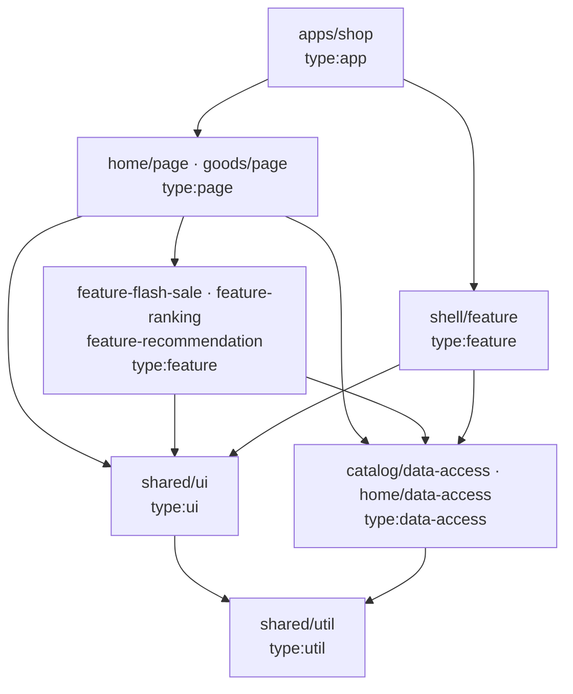

可與 AI / Agents 討論：
架構方向
Workflow Planning
Implementation Strategy

**規則**
我們為了MOMO考試因此做出demo頁面,請先不要思考或者擅自亂做往下的動作
我們目的為做出首頁展示頁面與如果是商品就開放點擊,進到good detail頁面,good detail 頁面也是展示用因此不可以擅作主張往下做,例如我們有直接購買但不可以真的點擊直接購買可以進到購買頁面。
## 初步內容解析
### 首頁:
https://www.momoshop.com.tw/main/Main.jsp?mdiv=1099800000-bt_0_243_01-bt_0_243_01_e1&ctype=B
![[Pasted image 20260918141833.png]]
可以選擇分類，下面為點擊展開後的分類
![[Pasted image 20260918142238.png]]
本身這塊為header scroll保留區塊,當我往下滾動時這一塊要保留
![[Pasted image 20260918153423.png]]

滾動時樣式,可以看到他被保留了
![[Pasted image 20260918153442.png]]
我們首頁整體順序
header 包含還有momo logo
以及往下的種類可展開圖
下面的主要活動
![[Pasted image 20260918153524.png]]
官方優惠
![[Pasted image 20260918153820.png]]

往下繼續滑動
降價好貨
![[Pasted image 20260918153850.png]]

再往下滑區塊
品牌折扣
詐騙發票提醒
![[Pasted image 20260918153922.png]]

再往下區塊
官方旗艦名店
![[Pasted image 20260918154124.png]]
再往下
momo店取
momo信用卡優惠
猜你想搜
![[Pasted image 20260918154212.png]]

限時搶購
![[Pasted image 20260918154320.png]]

今日暢銷榜
moPro訂閱享會員專屬價
![[Pasted image 20260918154413.png]]

你可能會喜歡
![[Pasted image 20260918154449.png]]
因為裡面內容太多滾到一定程度後,下面會看到有個看更多,就可以點擊後出現更多商品了
![[Pasted image 20260918154541.png]]

我們先設定假設3列就要出現看更多了
首頁最下面的Footer,偏深藍色那個區塊
![[Pasted image 20260918154815.png]]

### goods detail 頁面
https://www.momoshop.com.tw/product/15687497?Area=search&mdiv=403&oid=1_1&cid=index&kw=iPhone+18+Pro&ecTagNos=

![[Pasted image 20260918152638.png]]
由於時間不夠,我們首頁做完後優先做出這個頁面的這個畫面即可其餘可選擇性暫時忽略,左邊有商品圖右邊有描述,描述要有title 還有商品說明即可,下面要有直接購買與放入購物車與加入追蹤的button
![[Pasted image 20260918152934.png]]
滑到下面要有footer

我有個素材區域,後續作出repo可以從素材區域搬遷需要且對應的內容到專案當中
素材目前區域位置:
D:\repo\momo素材

## AI 回饋我們要設計的架構:

> 版本：**v2**（2026-09-18，經自我審查後定案）｜實作 repo：`D:\repo\momo-shop-work`
> 本段會同步成 repo 的 `docs/architecture.md` 與 `docs/adr/*`，給面試官看。

> [!note] v1 → v2 自我審查修正了什麼
> 1. `shared/ui` 不認識 domain model：`ProductCard` 只宣告最小形狀 `ProductCardItem`，`Product` 靠 structural typing 傳入（v1 照寫會變成 ui → data-access 違規依賴）。
> 2. 補上 `paths`（URL 單一來源），避免各 feature 手寫 `/goods/${id}`。
> 3. Repository 改由 **Context 注入**，composition root 在 `app/providers.tsx`（v1 是 hooks 直接 import singleton，測試只能吃真 fixture）。
> 4. `telemetry` 從 P1 提到 P0（TDD #5 依賴它，v1 優先序自相矛盾）。
> 5. 限時搶購 `endsAt` 不寫死在 fixture：mock repository 注入 `now()`。
> 6. 交付順序改 **walking skeleton 先行**；goods detail 排在 flash-sale / ranking 之前（前者不可砍、後者可砍）。
> 7. design tokens 從 app 移到 `shared/ui/styles/theme.css`（token 屬於 design system）。
> 8. 用字：13 個業務區塊 = 15 筆 section 設定；Rule of Two 計數單位是 project（lib 或 app）。

### 0. 範圍（Scope）— 先講不做什麼

| 做 | 不做（寫進 README 的 Known Gaps） |
|---|---|
| `/` 首頁：Header(sticky) → 分類(可展開) → 13 個業務區塊 → Footer | 搜尋功能（搜尋框純展示）、`/search` `/live` `/discover` |
| `/goods/:goodsId`：左商品圖、右 title + 商品說明、下方三顆按鈕、Footer | **詳情頁任何互動**：直接購買 / 放入購物車 / 加入追蹤 皆**只渲染、不綁行為** |
| **只有商品卡可點** → 進詳情頁 | Banner 不可點（沒有對應頁面）；右側浮動欄、登入、購物車、結帳 |
| 「你可能會喜歡」3 列後出現「看更多」 | RWD（Desktop-first，固定容器寬 1220px，同 momo 桌機版）；商品名稱/價格為生成的假資料 |

### 1. 設計原則（所有決策都回到這 5 條）

1. **依賴方向單向且由 lint 強制**：`app → page → feature → ui / data-access → util`，不是靠自律。
2. **切 lib 的準則**：「有自己的邏輯 / 自己的資料 / 首頁以外會被重用」才獨立成 feature lib；純 CMS 圖片區塊不拆（避免空殼 lib）。
   - **Rule of Two（共用門檻）**：元件 / 函式**被 ≥2 個 project（lib 或 app）使用**才能進 `shared/ui`、`shared/util`。只有自己用的，一律放該 lib 自己的 `ui/`（展示）或 `model/`（邏輯、hooks），且**不從 `index.ts` 匯出**（= lib 私有）。
   - **升級路徑**：feature 私有 → 出現第 2 個使用者 → 只在同 domain 共用升到 `libs/<scope>/ui`，跨 domain 才升到 `shared/ui`。
   - **由工具強制**：Nx boundary rule 禁止 deep import（只能走 `index.ts`）+ 禁止 feature ✗ feature，想偷用別人的私有元件會直接 lint error。
   - feature / page lib 內部統一結構：`<name>.tsx`（container：抓資料 + 組合）｜`ui/`（私有展示）｜`model/`（私有邏輯）｜`index.ts` 只匯出 container。
3. **首頁是資料驅動（config-driven）**：區塊順序與內容來自 `HomeSection[]`，不是寫死在 JSX。
4. **框架耦合集中在一處**（皆以 `no-restricted-imports` 強制）：`react-router` 只准出現在 `apps/shop`；`embla-carousel-react` 只准出現在 `shared/ui`。換 Next / 換輪播套件只改一處。
5. **資料走 Repository 接縫 + Context 注入**：UI 只認 hooks，hooks 只認 repository interface；用哪個實作由 composition root（`app/providers.tsx`）決定。mock → 真 API 只改那一行。
   - 連帶規則：**`shared/ui` 不認識 domain model**。ui 元件只宣告自己需要的最小形狀（例：`ProductCardItem`），domain 的 `Product` 靠 TS structural typing 直接傳入，雙方零 import。

### 2. 技術選型

| 面向 | 選擇 | 為什麼 | 放棄的方案 |
|---|---|---|---|
| Monorepo | **Nx**（pnpm） | `enforce-module-boundaries` + tags 強制分層；`nx affected` 給 CI | 單一 Vite app（退路，見 §9） |
| 框架 | **React 19 + TypeScript strict + Vite** | 靜態部署、面試官開網址即看 | **Next**：mock-only 無 SEO 需求、RSC 邊界決策吃時間 → ADR-0001 記錄演進 |
| 路由 | **React Router v7**（library mode + lazy route） | route-level code splitting；日後可升 framework mode 做 SSR | TanStack Router（團隊熟悉度低） |
| Server state | **TanStack Query v5** | loading / error / cache 與真 API 同契約；`useInfiniteQuery` 做「看更多」 | 直接 import fixture（之後換 API 要改全部元件） |
| Client state | **目前不裝任何 store** | 兩頁皆展示用，全域 client state = 0；展開 / 輪播用 local state | Zustand / RTK → ADR-0003：出現購物車再上輕量 store，跨 domain 流程變複雜再換 **Redux Toolkit** |
| 樣式 | **Tailwind CSS v4**（`@theme` design tokens） | 與 Agent 協作最快；token 集中（momo 粉 / 價格紅） | CSS Modules（慢）、UI kit（與 momo 視覺差太多） |
| 輪播 | **embla-carousel-react** | headless、體積小；包在 `shared/ui` 內可抽換 | Swiper（重、樣式侵入） |
| 單元測試 | **Vitest + Testing Library + user-event** | Nx 原生支援；TDD 主力 | Jest |
| E2E（P2） | **Playwright**（`@nx/playwright`） | 一條 smoke：首頁 → 點商品 → 詳情頁 | Cypress |
| 錯誤隔離（P1） | **react-error-boundary** | 單一區塊掛掉不拖垮整頁 + 回報 telemetry | 手寫 class |
| CI（P1） | GitHub Actions：`nx affected -t lint test build` | Delivery thinking | — |

### 3. 分層與依賴規則（Nx tags）



| `type:` | 可依賴 | 職責 |
|---|---|---|
| `app` | page, feature, ui, data-access, util | 薄殼 + **composition root**：router、providers、注入 Link 與 repository 實作 |
| `page` | feature, ui, data-access, util | 組合多個 feature 成一頁（**唯一能同時 import 多個 feature 的層**） |
| `feature` | ui, data-access, util | 有邏輯的業務區塊（smart component）；**feature ✗ feature** |
| `ui` | ui, util | 純展示元件；不碰資料、不碰 router、不認識 domain model |
| `data-access` | util | 型別、repository interface + 實作、query hooks、fixtures；**data-access ✗ data-access** |
| `util` | util | 純函式 |

- `scope:` 規則：`home → home, catalog, shared`｜`goods → goods, catalog, shared`｜`shell → shell, catalog, shared`｜`catalog → catalog, shared`｜`shared → shared`
- Import alias：`@momo/shared-ui`｜`@momo/shared-util`｜`@momo/catalog-data-access`｜`@momo/catalog-feature-recommendation`｜`@momo/home-data-access`｜`@momo/home-feature-flash-sale`｜`@momo/home-feature-ranking`｜`@momo/home-page`｜`@momo/goods-page`｜`@momo/shell-feature`

### 4. 檔案架構（1 app + 10 libs）

> `home/data-access` 與 `catalog/data-access` 分開的原因：首頁版位（CMS）與商品目錄（Catalog）在真實電商是兩個不同的後端來源，混在一起之後最難拆。兩者只靠 `collection` 字串 key 鬆耦合，互不 import。

```
momo-shop-work/
├─ apps/shop/                              type:app
│  ├─ public/assets/                       素材（資料夾改英文 slug，見 §7）
│  └─ src/
│     ├─ main.tsx
│     ├─ styles.css                        @import tailwind + shared/ui theme.css；@source 掃 libs
│     └─ app/
│        ├─ app.tsx
│        ├─ providers.tsx                  ★ composition root：QueryClient(+onError→telemetry)
│        │                                   + CatalogRepositoryProvider(mock) + HomeRepositoryProvider(mock) + LinkProvider
│        ├─ router.tsx                     ★ 全專案唯一 import react-router 的地方；路徑取自 shared/util paths
│        ├─ router-link.tsx                RR <Link> → shared/ui LinkProvider 的 adapter
│        └─ routes/  home.route.tsx · goods.route.tsx(useParams → props) · not-found.route.tsx
│
├─ libs/shared/ui/                         type:ui  scope:shared   ★ 只收「≥2 個 project 在用」的元件
│  └─ src/
│     ├─ styles/theme.css                  @theme design tokens（品牌粉、價格紅、容器寬、圓角）
│     └─ lib/
│        ├─ link/            LinkProvider + AppLink（預設 <a>）      使用者：ProductCard / shell / home blocks
│        ├─ product-card/    ProductCardItem 型別 + 基底卡片 + slots（topBadge / promoText / footer / priceLabel）
│        │                                                           使用者：home product-rail / flash-sale / ranking / recommendation
│        ├─ price-tag/       售價 + 劃線原價                          使用者：ProductCard / goods-info
│        ├─ carousel/        ★ 唯一 import embla（prev / next / dots / perView）
│        │                                                           使用者：home hero·banner-carousel·product-rail / flash-sale
│        ├─ section-header/                                          使用者：home blocks / ranking / recommendation
│        └─ skeleton/        (P1)                                    使用者：home / recommendation / goods
│
├─ libs/shared/util/                       type:util  scope:shared   ★ 同樣套 Rule of Two
│  └─ src/lib/
│     ├─ format-price.ts     使用者：PriceTag / goods-info
│     ├─ paths.ts            URL 單一來源：paths.home()、paths.goods(id)、pattern 給 router      使用者：app router / 4 個商品區塊
│     └─ telemetry.ts        reportError / track，sink 可替換（預設 console）                    使用者：home SectionRenderer / app providers
│
├─ libs/catalog/data-access/               type:data-access  scope:catalog
│  └─ src/
│     ├─ index.ts
│     ├─ testing.ts                        次要入口：createFakeCatalogRepository + 測試用 Provider wrapper
│     └─ lib/
│        ├─ models/          product.ts · flash-sale.ts · category.ts · page.ts（Page<T>{ items, nextOffset }）
│        ├─ repository/      catalog-repository.ts（interface）
│        │                   mock-catalog-repository.ts（createMockCatalogRepository({ now, latencyMs })）
│        │                   catalog-repository-context.tsx（Provider + useCatalogRepository）
│        ├─ fixtures/        products.generated.ts · collections.ts · categories.ts
│        ├─ hooks/           use-product · use-product-collection · use-recommendations（infinite）
│        │                   use-flash-sale · use-ranking · use-categories
│        └─ query-keys.ts
├─ libs/catalog/feature-recommendation/    type:feature  scope:catalog   你可能會喜歡（詳情頁日後可重用 → 放 catalog 不放 home）
│  └─ src/lib/
│     ├─ recommendation.tsx               container：useRecommendations + 組合
│     ├─ ui/     recommendation-grid.tsx · load-more-button.tsx              ← 私有
│     └─ model/  page-size.ts（ROWS_PER_LOAD 3 × COLUMNS 5 = 15）
│
├─ libs/home/data-access/                  type:data-access  scope:home
│  └─ src/lib/  models/home-section.ts（HomeSection union · Banner · Shortcut）
│               repository/ home-repository.ts · mock-home-repository.ts · home-repository-context.tsx
│               fixtures/home-layout.ts · hooks/use-home-layout.ts
├─ libs/home/feature-flash-sale/           type:feature  scope:home   限時搶購
│  └─ src/lib/
│     ├─ flash-sale.tsx                   container：useFlashSale；每張 slide = 10 件（5 × 2 grid）
│     ├─ ui/     countdown.tsx · flash-sale-header.tsx · stock-left.tsx · grab-badge.tsx   ← 私有
│     └─ model/  get-remaining.ts（純函式）· use-countdown.ts · chunk.ts
├─ libs/home/feature-ranking/              type:feature  scope:home   今日暢銷榜
│  └─ src/lib/  ranking.tsx · ui/rank-badge.tsx                                 ← 私有
├─ libs/home/page/                         type:page  scope:home
│  └─ src/lib/
│     ├─ home-page.tsx                    useHomeLayout → <SectionRenderer sections />
│     ├─ section-renderer/  section-renderer.tsx（純：吃 sections props）· registry.ts · section-boundary.tsx(P1)
│     └─ blocks/            hero · banner-carousel · banner-grid · shortcut-bar · notice · product-rail   ← 全部 page 私有
│                           （product-rail = SectionHeader + Carousel + ProductCard + useProductCollection）
│
├─ libs/goods/page/                        type:page  scope:goods
│  └─ src/lib/  goods-detail-page.tsx（props: goodsId；useProduct）
│               ui/ goods-gallery · goods-info · goods-actions（純展示，無 handler）· goods-not-found   ← 私有
│
├─ libs/shell/feature/                     type:feature  scope:shell
│  └─ src/lib/  shell-layout.tsx（Header + children + Footer）
│               ui/    top-bar（sticky；捲動後 compact 顯示搜尋框）· main-header（logo + 搜尋框展示）
│                      category-nav（橫向分類 + 展開「選擇分類」面板）· footer                       ← 私有
│               model/ use-compact-header.ts（IntersectionObserver）
│
├─ tools/gen-fixtures.mjs                  掃 public/assets → 產生 products.generated.ts（決定性，不用亂數）
├─ docs/  architecture.md · adr/0001~0005 · agent-workflow.md
├─ .github/workflows/ci.yml                (P1)
├─ eslint.config.mjs                       depConstraints + no-restricted-imports 在這
└─ README.md
```

每個 lib 只透過 `src/index.ts` 對外（public API）；測試檔 `*.spec.ts(x)` 與原始碼同層。

### 5. 首頁 config-driven 設計

```ts
type Banner   = { id: string; imageUrl: string; alt: string; caption?: string };  // 不可點
type Shortcut = { id: string; iconUrl: string; label: string };

type HomeSection =
  | { id: string; type: 'hero';            banners: Banner[]; aside: { title: string; items: Banner[] } }
  | { id: string; type: 'banner-carousel'; title?: string; perView: number; banners: Banner[] }
  | { id: string; type: 'banner-grid';     title?: string; columns: number; banners: Banner[] }
  | { id: string; type: 'shortcut-bar';    items: Shortcut[] }
  | { id: string; type: 'notice';          banner: Banner }
  | { id: string; type: 'product-rail';    title: string; collection: string }  // CMS 只給 key，商品由 catalog 提供
  | { id: string; type: 'flash-sale';      title: string }   // ↓ 三個交給 feature lib，自己抓資料
  | { id: string; type: 'ranking';         title: string }
  | { id: string; type: 'recommendation';  title: string };
```

- `registry.ts` 以 mapped type 綁定 `type → Component`：**union 新增型別卻沒寫 renderer → 編譯期報錯**。
- 執行期遇到未知 type（未來 API 先上新區塊）→ 不渲染 + `reportError`，頁面不壞。
- `SectionRenderer` 是純元件（吃 `sections` props），抓資料只在 `HomePage` → 好測、好搬。
- 每個區塊外包 `SectionBoundary`（P1）：單區塊失敗不影響其他區塊。

13 個業務區塊 → 15 筆 section 設定（官方優惠拆 3 筆）：

| 首頁區塊（由上到下） | section type | 素材資料夾 |
|---|---|---|
| 主要活動 + 今日大牌 | `hero` | 主要活動 |
| 官方優惠：8 格圖示輪播 | `banner-carousel`(perView 8) | 官方優惠 |
| 官方優惠：秒殺/簽到/分次配/領券/看更多 | `shortcut-bar` | 官方優惠（符號圖） |
| 官方優惠：超大牌 左/中/右 | `banner-grid`(3) | 官方優惠（超大牌） |
| 降價好貨 | `product-rail` | 降價好貨 |
| 品牌折扣 | `banner-grid`(6) | 品牌折扣 |
| 詐騙發票提醒 | `notice` | 發票詐騙提醒 |
| 官方旗艦名店 | `banner-grid`(4) | 官方旗艦名店 |
| momo 店取 | `product-rail` | momo店快取 |
| 信用卡加碼優惠 | `banner-carousel` | 信用卡加碼優惠 |
| 猜你想搜 | `banner-grid`（caption = 關鍵字） | 猜你想搜 |
| 限時搶購 | `flash-sale` → feature lib | 限時搶購 |
| 今日暢銷榜 | `ranking` → feature lib | 今日暢銷榜 |
| moPro 會員專屬價 | `product-rail`（日後有會員價邏輯再抽 feature） | momopro… |
| 你可能會喜歡（3 列 + 看更多） | `recommendation` → feature lib | 你可能會喜歡 |

時間不夠時的砍法：**從 `home-layout.ts` 刪一行**即可下架區塊，不用改元件。

### 6. 資料層

```ts
interface Product {
  id: string;              // 取自素材檔名：15642257_OL_m.webp → "15642257"
  name: string;
  imageUrl: string;
  images: string[];        // 詳情頁 gallery
  price: number;
  originalPrice?: number;
  description: string[];   // 詳情頁商品說明（條列）
}
interface FlashSaleItem extends Product { promoText: string; stockLeft: number }

interface CatalogRepository {
  getProduct(id: string): Promise<Product | null>;
  getCollection(key: string): Promise<Product[]>;          // 未知 key → []
  getRecommendations(p: { offset: number; limit: number }): Promise<Page<Product>>;
  getFlashSale(): Promise<{ endsAt: string; items: FlashSaleItem[] }>;
  getRanking(): Promise<Product[]>;
  getCategories(): Promise<Category[]>;
}
```

- **DI**：`createMockCatalogRepository({ now, latencyMs })` 在 `app/providers.tsx` 建立並用 Context 注入；hooks 透過 `useCatalogRepository()` 取得。測試注入 fake repository（資料量小、可控），不依賴真 fixture。
- `getFlashSale().endsAt` = `now() + N 小時`，不寫死在 fixture（否則倒數會過期）。
- 首頁與詳情頁共用同一份 product fixture（single source of truth），所以每張商品卡都點得進詳情頁。
- fixtures 用 `.ts` + `satisfies`，型別錯在編譯期就擋下；由 `tools/gen-fixtures.mjs` 決定性產生（同輸入同輸出，diff 乾淨）。
- 促銷資料暫放 catalog；促銷邏輯變多再抽 `promotion/data-access`（寫進 ADR）。

### 7. 素材搬遷（中文資料夾 → 英文 slug，避免 URL encode 問題）

`logo→brand`｜`Footer→footer`｜`主要活動→home/main-events`（今日大牌→`today-brand`）｜`官方優惠→home/official-deals`｜`降價好貨→home/price-drop`｜`品牌折扣→home/brand-discount`｜`發票詐騙提醒→home/fraud-notice`｜`官方旗艦名店→home/flagship-stores`｜`momo店快取→home/store-pickup`｜`信用卡加碼優惠→home/card-offers`｜`猜你想搜→home/search-suggest`｜`限時搶購→home/flash-sale`｜`今日暢銷榜→home/best-sellers`｜`momopro…→home/mopro`｜`你可能會喜歡→home/recommendations`

### 8. 測試策略（TDD 只打有邏輯的地方）

| # | 對象 | 驗證什麼 |
|---|---|---|
| 1 | `shared/util` | `formatPrice`（千分位、0）；`paths.goods(id)` |
| 2 | `ProductCard` / `PriceTag` | 名稱 / 售價 / 劃線價；`href` 正確落在連結上；slots 有渲染 |
| 3 | `mock-catalog-repository` | 找得到 / 找不到回 null；未知 collection 回 `[]`；分頁 `nextOffset` 正確、最後一頁為 null；`endsAt` 跟著注入的 `now` |
| 4 | `feature-recommendation` | 注入 fake repo：初始 1 頁 → 點「看更多」增加 → 全部載完按鈕消失 |
| 5 | `SectionRenderer` | 依 type 渲染；未知 type 不渲染且呼叫 `reportError` |
| 6 | `CategoryNav` | 展開 / 收合（`aria-expanded`） |
| 7 | `feature-flash-sale` | `get-remaining`（含過期歸零）；`chunk`；fake timers 下倒數顯示正確 |
| 8 | `GoodsDetailPage` | title / 說明 / 三顆按鈕存在；商品不存在顯示 not-found |
| P2 | Playwright | 首頁 → 點商品卡 → 詳情頁可見 |

不測：純版面區塊（banner 類）、`use-compact-header`（jsdom 無 IntersectionObserver，交給 E2E）—— 刻意的 tradeoff，寫進 README。

### 9. 交付順序與退路

Commit 切片（每片一個 commit，帶 `Co-Authored-By`）—— **walking skeleton 先行，不可砍的先做**：

1. `chore:` Nx scaffold
2. `chore:` 10 libs + tags + boundary rules + restricted imports
3. `docs:` architecture + ADR（設計先於實作，留在 git history）
4. `feat(shop):` walking skeleton — router + providers + shell 空殼 + 兩個空頁面（此時兩條路由已可走通）
5. `chore(assets):` 素材搬遷 + `gen-fixtures` + `catalog/data-access`（TDD #3）
6. `feat(shared):` util（TDD #1）+ ui：ProductCard / PriceTag / Carousel / SectionHeader / Link（TDD #2）
7. `feat(shell):` TopBar sticky / MainHeader / CategoryNav（TDD #6）/ Footer
8. `feat(home):` home/data-access + SectionRenderer（TDD #5）+ 6 個 blocks
9. `feat(recommendation):` 3 列 + 看更多（TDD #4）
10. `feat(goods):` 詳情頁（TDD #8）
11. `feat(flash-sale):` 倒數 + 2 列輪播（TDD #7）→ 12. `feat(ranking)`
13. `docs:` README（tradeoff / known gaps / 演進）+ `ci:`

- **砍功能順序（先砍 → 後砍）**：Playwright → CI → SectionBoundary / Skeleton → ranking → flash-sale → 信用卡 / 猜你想搜區塊。**不砍**：首頁骨架、recommendation、goods detail、README。
- **退路**：Nx scaffold 超過 10 分鐘仍卡住 → 改單一 Vite app，`src/libs/*` 保留同樣目錄 + `eslint-plugin-boundaries` 維持同一套依賴規則。

### 10. ADR 清單（後續演進方向）

| ADR | 決策 | 演進觸發條件 |
|---|---|---|
| 0001 | SPA（Vite）而非 Next | 需要 SEO / LCP → RR framework mode 或 Next；因 router 只在 app 層、Link 由 app 注入、資料走 Query，遷移面小 |
| 0002 | 單一 app + domain libs | `/live`、`/discover`、商家後台由不同團隊負責 → 拆 multi-app / Module Federation |
| 0003 | 只有 TanStack Query，無全域 store | 出現購物車 / 會員 → 輕量 store；購物車 × 優惠券 × 結帳跨 domain → **Redux Toolkit**；state 一律包在 data-access hooks 後面，抽換不動 feature |
| 0004 | 首頁 config-driven | 接 CMS API 時只換 `home/data-access` 的 repository 實作 |
| 0005 | Repository + Context 注入，而非 MSW | 要做 contract test / 網路層模擬時再引入 MSW |
