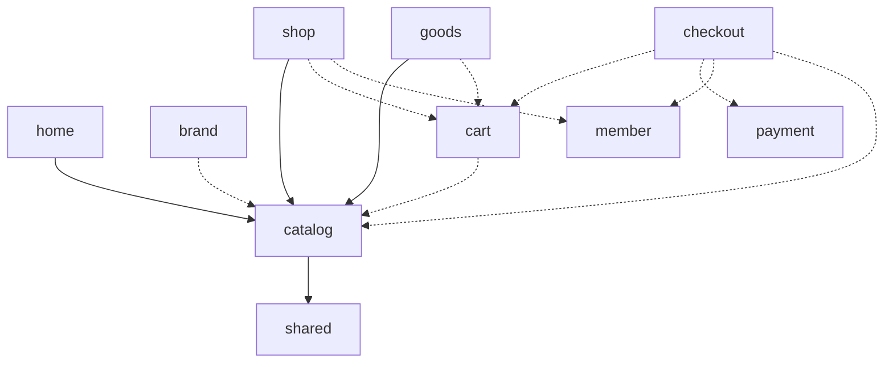

# ADR-0006：Domain 依賴地圖與 scope 放行的治理

狀態：已採用

## 背景

設計復盤時提出的問題：「程式碼大量放在 libs，日後擴充購物車、結帳、品牌頁、刷卡等很多頁面時，libs 不會變得很肥大嗎？」

結論分兩層：

- `packages/` 資料夾變大不是問題，它就是 `src/`。成長方式應該是**新增 scope**，而不是養大既有的 package（拆分準則見 `architecture.md` §5）。
- 真正會腐化的是 **scope 的放行清單**。5 個 scope 時沒事；到 12 個 scope 時，最常見的劣化是有人遇到 lint 錯誤就「在放行清單加一個 scope」，幾年後每個 domain 都能依賴每個 domain，規則名存實亡。

## 決策

1. 「哪個 domain 可以依賴哪個 domain」以本文件的地圖為準。**新增任何 scope 放行前，必須先修改這份 ADR**，並說明為什麼這個方向的依賴是合理的。
2. 依賴圖必須保持**無環**，且 `catalog` 位於最底層（不依賴任何其他 domain）。
3. 各 domain 擁有自己的 model。跨 domain 傳遞 id 或最小形狀，不共用 model（例：購物車的 `CartLine` 存 `productId` 與下單當下的價格快照，而不是 import `catalog` 的 `Product`）。

現有的 `type:` 規則已經保證跨 domain 的依賴只會有兩種形式，不需要額外規則：

- `feature` / `page` / `layout` → 對方的 `data-access`（讀資料）
- `page` / `layout` → 對方的 `feature`（組合，例：首頁與詳情頁都掛 `catalog/feature-recommendation`）

`feature → feature` 與 `data-access → data-access` 不論是否跨 domain 都是 lint 錯誤。

## 地圖

實線是現況，虛線是預期的演進。

| Domain     | 預期內容                                | 可依賴                                   |
| ---------- | --------------------------------------- | ---------------------------------------- |
| `catalog`  | 商品、分類、推薦                        | shared                                   |
| `home`     | 首頁版位、限時搶購                      | catalog, shared                          |
| `goods`    | 商品詳情                                | catalog, shared（＋ cart：加入購物車）   |
| `brand`    | 品牌頁                                  | catalog, shared                          |
| `cart`     | 購物車（此時才引入 store，見 ADR-0003） | catalog, shared                          |
| `member`   | 登入、會員資料                          | shared                                   |
| `payment`  | 刷卡、分期                              | shared                                   |
| `checkout` | 結帳流程                                | cart, payment, member, catalog, shared   |
| `shop`     | 整個店面共用的部分，目前只有全站外框    | catalog, shared（＋ cart、member，見下） |

`shop` 是刻意的例外：全站外框本來就會用到多個 domain 的東西。怎麼用，分兩種：

- **摘要資料**（購物車數量徽章、登入狀態）→ 讀對方的 `data-access`，由外框自己的私有元件顯示。
- **對方擁有的互動元件**（mini-cart 下拉、搜尋自動完成）→ 那是對方 domain 的 `feature`，由外框組合。

### 修訂：外框從 `type:feature` 改為 `type:layout`

這份 ADR 原本寫的是「外框只能依賴對方的 `data-access`，不能依賴 feature」。那句話不是獨立的設計目標，而是外框當時被標成 `type:feature`、受 `feature ✗ feature` 約束的**結果**。它對摘要資料成立，但對互動元件只留下兩條路：把購物車或搜尋的邏輯寫進外框 package（外框變肥，且擁有不屬於它的邏輯），或是破壞規則。

外框實際所在的層級與 `page` 相同 —— 只有 app 的 router 會 import 它，它與 page 由路由巢狀組合、彼此不 import。因此新增 `type:layout` 一層，權限與 `page` 相同（可組合 feature），並把 scope 從 `layout` 改名為 `shop`：`layout` 描述的是「哪一種專案」，屬於 `type:`，不是一個 domain。

風險與原本的顧慮相同：外框依賴的 domain 越多，任何 domain 的修改都越容易讓它被判定為 affected。控制方式不變 —— 每一個新的放行仍然要先改這份地圖。

`payment` 不依賴 `checkout`、也不依賴 `cart`：付款元件不該知道自己被誰使用。這同時讓它日後能被隔離（信用卡表單屬於 PCI-DSS 範圍，見 ADR-0002）。

## 代價

新增 domain 時多一個步驟（先改 ADR）。這是刻意的摩擦：它把「加一行放行」從反射動作變成一個需要說明理由的設計決定。
