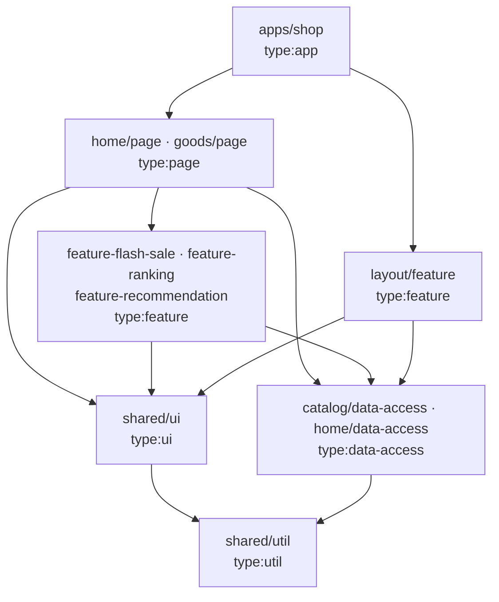

# 架構說明

> 這份文件描述「系統現在長什麼樣、為什麼這樣切、規模變大時怎麼管」。
> 設計有變動時**先改這份文件再改 code**。決策的來龍去脈在 [`adr/`](./adr)，設計過程的原始筆記在 [`MoMO面試/`](./MoMO面試)。
>
> 三者的分工：**本文件**說明結構；**ADR** 說明每個決策為什麼這樣選、代價是什麼；**OpenSpec** 說明系統**對外可觀察的行為** —— [`openspec/specs/`](../openspec/specs) 是已實作的現況，[`openspec/changes/build-storefront-pages/`](../openspec/changes/build-storefront-pages) 是待實作的部分，每條 requirement 都附可直接轉成測試的 scenario。判斷「實作對不對」時以 OpenSpec 為準。

## 1. 範圍

| 做                                                              | 不做（見 README 的 Known Gaps）                                       |
| --------------------------------------------------------------- | --------------------------------------------------------------------- |
| `/` 首頁：sticky Header → 可展開分類 → 13 個業務區塊 → Footer   | 搜尋（搜尋框純展示）、`/search` `/live` `/discover`                   |
| `/goods/:goodsId`：左商品圖、右標題與商品說明、三顆按鈕、Footer | **詳情頁任何互動**：三顆按鈕只渲染、不綁行為                          |
| 只有商品卡可點 → 進詳情頁                                       | Banner 不可點、右側浮動欄、登入、購物車、結帳                         |
| 「你可能會喜歡」3 列後出現「看更多」                            | RWD（Desktop-first，固定容器寬 1220px）；商品名稱與價格為生成的假資料 |

目標畫面的截圖在 [`pictures/`](./pictures)（依頁面由上到下編號）。

## 2. 設計原則

1. **依賴方向單向，且由 lint 強制**，不靠自律：`app → page → feature → ui / data-access → util`。
2. **Lib 依職責切分，並有明確的共用門檻**（見 §5 的 Rule of Two 與粒度準則）。
3. **首頁是資料驅動的**：區塊順序與內容來自 `HomeSection[]`，不是寫死在 JSX。
4. **框架耦合集中在一處**：`react-router` 只准出現在 `apps/shop`，`embla` 只准出現在 `libs/shared/ui`。換 SSR 框架或換輪播套件是單一專案的修改。
5. **資料走 Repository 接縫 + Context 注入**：UI 只認 hooks，hooks 只認 interface；用哪個實作由 composition root（`apps/shop` 的 providers）決定。
   - 連帶規則：**`shared/ui` 不認識 domain model**。元件只宣告自己需要的最小形狀（例：`ProductCardItem`），domain 的 `Product` 靠 structural typing 直接傳入，雙方零 import。

## 3. 分層與依賴規則



| `type:`       | 可依賴                               | 職責                                                                                    |
| ------------- | ------------------------------------ | --------------------------------------------------------------------------------------- |
| `app`         | page, feature, ui, data-access, util | 薄殼 + **composition root**：router、providers、注入 Link 與 repository 實作            |
| `page`        | feature, ui, data-access, util       | 把多個 feature 組合成一頁。**唯一能同時 import 多個 feature 的層**                      |
| `feature`     | ui, data-access, util                | 有邏輯的業務區塊（smart component）。**feature ✗ feature**                              |
| `ui`          | ui, util                             | 純展示元件。不碰資料、不碰 router、不認識 domain model                                  |
| `data-access` | util                                 | 型別、repository interface 與實作、query hooks、fixtures。**data-access ✗ data-access** |
| `util`        | util                                 | 純函式                                                                                  |

`scope:` 規則（domain 之間誰能依賴誰，治理方式見 [ADR-0006](./adr/0006-domain-dependency-map.md)）：

| scope     | 可依賴的 scope          |
| --------- | ----------------------- |
| `home`    | home, catalog, shared   |
| `goods`   | goods, catalog, shared  |
| `layout`  | layout, catalog, shared |
| `catalog` | catalog, shared         |
| `shared`  | shared                  |

一個專案必須**同時**滿足自己的 `type:` 與 `scope:` 限制。`apps/shop` 只有 `type:app`，所以能組合所有 scope。

### 怎麼強制、怎麼驗證

- 規則寫在根目錄 [`eslint.config.mjs`](../eslint.config.mjs)：`@nx/enforce-module-boundaries`（6 條 type + 5 條 scope）與 `no-restricted-imports`。tags 宣告在各專案 `package.json` 的 `nx.tags`。
- `no-restricted-imports` 採「預設全禁、單點放行」：根設定兩個套件都禁，`apps/shop` 與 `libs/shared/ui` 在**自己的** eslint 設定用 `restrictedImports([...])` 明確放行 —— 例外寫在它生效的地方。
- **lib 的「私有」由兩道關卡保證**（都實際放入違規樣本驗證過）：每個 lib 的 `package.json` 的 `exports` 只公開 `.`（即 `src/index.ts`），所以以「套件名稱 + 內部路徑」引用會在**型別檢查**失敗（TS2307）；以相對路徑跨專案引用會被 **lint** 擋下。沒有從 `index.ts` 匯出的東西就是 lib 私有的。因為兩道關卡來自不同工具，驗證時 `lint` 與 `typecheck` 都要跑。
- **跨專案 import 要先宣告依賴**：在自己的 `package.json` 加上 `"@momo/<lib>": "workspace:*"`，執行 `pnpm install` 與 `nx sync`（更新 TypeScript project references）。pnpm 的嚴格 `node_modules` 不會解析未宣告的 workspace 套件 —— 依賴必須明說。
- **這些規則被驗證過會擋，而不只是存在**：建立時放入 5 個故意違規的探針檔（feature→feature、ui→data-access、scope:goods→scope:home、lib 內 import router、`shared/ui` 以外 import embla），全部被 lint 擋下；2 個合法的對照組通過。紀錄見 [`agent-workflow.md`](./agent-workflow.md)。
- **lint 回答不了的問題由 [`tools/verify-boundaries.mjs`](../tools/verify-boundaries.mjs) 回答**（`pnpm verify:boundaries`）：
  1. 每個專案的 tags 格式正確、恰好一個 `type:`、lib 恰好一個 `scope:`、且都是 private。**tags 寫壞的 lib 會靜默地不受任何規則約束，而 lint 依然是綠的** —— 這個錯誤在建立 lib 時真的發生過。
  2. 每個專案**實際解析出來的** ESLint 設定裡，boundary 規則是 `error`、限制條數一致；只有 `shop` 能 import router、只有 `shared-ui` 能 import embla。
  3. Nx project graph 裡每一條專案間的依賴，逐條比對限制。

  限制是從有效的 ESLint 設定讀出來的，沒有第二份要同步。這支腳本本身也被驗證過會報紅：故意把一個 lib 的 tags 改壞，它以 exit 1 指出是哪個 lib、什麼問題。

## 4. Workspace 結構（1 app + 10 libs）

Nx 23、pnpm workspaces、TypeScript project references。每個 lib 是一個 workspace package，import 名稱即 package 名稱。

```
apps/shop                              @momo/shop                            type:app
libs/shared/ui                         @momo/shared-ui                       type:ui           scope:shared
libs/shared/util                       @momo/shared-util                     type:util         scope:shared
libs/catalog/data-access               @momo/catalog-data-access             type:data-access  scope:catalog
libs/catalog/feature-recommendation    @momo/catalog-feature-recommendation  type:feature      scope:catalog
libs/home/data-access                  @momo/home-data-access                type:data-access  scope:home
libs/home/feature-flash-sale           @momo/home-feature-flash-sale         type:feature      scope:home
libs/home/feature-ranking              @momo/home-feature-ranking            type:feature      scope:home
libs/home/page                         @momo/home-page                       type:page         scope:home
libs/goods/page                        @momo/goods-page                      type:page         scope:goods
libs/layout/feature                     @momo/layout-feature                   type:feature      scope:layout
```

每個 lib 的 README 寫明它的職責、可依賴的層、以及 `src/index.ts` 是唯一公開 API。

兩個值得說明的切分決定：

- **`home/data-access` 與 `catalog/data-access` 分開**：首頁版位（CMS）與商品目錄（Catalog）在真實電商是兩個不同的後端來源。兩者只靠 `collection` 字串 key 鬆耦合、互不 import —— 混在一起之後最難拆。
- **`feature-recommendation` 放在 `catalog` 而不是 `home`**：真實網站的商品詳情頁也有「你可能會喜歡」。放在 `home` 的話 `goods/page` 依 scope 規則拿不到它。

## 5. Lib 的內部結構、共用門檻與粒度準則

### 內部結構（feature / page lib 一致）

```
src/
├─ index.ts           只匯出 container —— lib 的公開 API
└─ lib/
   ├─ <name>.tsx      container：抓資料 + 組合
   ├─ ui/             私有展示元件（不匯出）
   └─ model/          私有邏輯與 hooks（不匯出）
```

測試檔 `*.spec.ts(x)` 與原始碼同層。

### Rule of Two（共用門檻）

元件或函式**被 ≥2 個專案（lib 或 app）使用**，才能進 `shared/ui`、`shared/util`。只有自己用的，留在該 lib 的 `ui/` 或 `model/`。

升級路徑：lib 私有 → 出現第 2 個使用者 → 只在同 domain 共用就升到 `libs/<scope>/ui`，跨 domain 才升到 `shared/ui`。因為 lint 禁止 deep import 與 feature ✗ feature，想偷用別人的私有元件會直接報錯 —— **升級是被工具逼出來的**。

例：「看更多」按鈕與展開邏輯只有 recommendation 用 → 留在 `feature-recommendation/ui`；倒數計時只有 flash-sale 用 → 留在 `feature-flash-sale`。

### 粒度準則：什麼時候拆 lib、什麼時候不拆

`libs/` 變大不是問題 —— 它就是 `src/`，程式碼總要有地方放。**要防的是單一 lib 變肥。** 成長的方式應該是「新增 scope」，而不是「養大既有的 lib」。

**該拆**（符合任一項）：負責的人或團隊不同｜變動頻率明顯不同｜是 lazy-load 的邊界｜會被第 2 個地方重用｜有自己的資料來源。

**不該拆**：不要每個 URL 一個 page lib（一個 domain 的路由群共用一個）｜不要每個元件一個 lib｜沒有邏輯的純版面區塊不拆（首頁的 CMS blocks 就留在 `home/page`）。每個 lib 約有 8 個設定檔的固定成本，空殼 lib 只有成本沒有收益。

**已知會先變肥的三個地方與拆分觸發條件：**

| Lib                   | 風險                                                              | 觸發條件 → 動作                                                                                 |
| --------------------- | ----------------------------------------------------------------- | ----------------------------------------------------------------------------------------------- |
| `catalog/data-access` | 目前同時放商品、分類、限時搶購、暢銷榜、推薦                      | 出現第 2 種促銷型別，或促銷有自己的後端 → 抽 `promotion/data-access`                            |
| `shared/ui`           | 全專案都依賴它；長大後任何修改都讓 `nx affected` = 全部，快取失效 | 元件超過約 15 個，或 affected 雜訊明顯 → 依元件家族拆（`shared/ui-product`、`shared/ui-form`…） |
| scope 放行清單        | scope 變多後，遇到 lint 錯誤就「加一個放行」，最後誰都能依賴誰    | 新增任何 scope 放行前必須先更新 [ADR-0006](./adr/0006-domain-dependency-map.md)                 |

### Layout：跨頁保留的外框

TopBar、主 header、分類列與 footer 屬於 **layout**，不屬於任何一頁。它們在每一條路由都存在，換頁時不會重新掛載。

```
RouterProvider
└─ LayoutRoute（沒有 path 的 layout route）        apps/shop/src/app/router.tsx
   └─ <AppLayout>                                   libs/layout/feature
      ├─ TopBar          fixed；主 header 捲出視窗後轉為 compact 並顯示搜尋框
      ├─ MainHeader      logo（連回首頁）+ 搜尋框（展示用）
      ├─ CategoryNav     橫向分類列 + 可展開的「選擇分類」面板
      ├─ <main> <Outlet /> </main>                  ← 只有這裡隨路由替換
      └─ Footer
```

- **機制**：`AppLayout` 掛在一條沒有 path 的 layout route 上，`/`、`/goods/:goodsId`、找不到頁面都是它的子路由，頁面內容透過 `<Outlet />` 換進去。路由的概念只存在於 `apps/shop`；`libs/layout/feature` 只拿到 `children`，不知道 router 的存在。
- **驗證**：`router.spec.tsx` 對三條路由都檢查 `banner`、`main`、`contentinfo` 三個 landmark 都在（規格 `app-layout`「每個頁面都有共用外框」）。
- **加第二種 layout**（例：結帳流程用沒有分類列、精簡 footer 的外框）：在 router 再掛一條 layout route 指向另一個 layout 元件，把結帳的路由放到它底下。現有的 `AppLayout` 與頁面都不用改。
- **命名**：這個 lib 原本叫 `shell`。改名為 `layout` 是因為 (1) 它就是一般所說的 layout；(2) 「shell library」在 Nx 社群有既定意思 —— 串接某個 domain 路由的進入點 lib —— 而這個 lib 做的是全站外框，沿用 `shell` 會讓熟悉 Nx 的讀者誤判它的用途。

### 設計 Token

顏色、字級、圓角、陰影走兩層 token：**Primitive**（有哪些顏色，元件不可用）→ **Semantic**（用在哪裡，元件唯一能用的一層）。Tailwind 預設的色盤與字級被關閉，所以不是 token 的顏色用不了。數值從真實網站的計算樣式量出。詳見 [`design-tokens.md`](./design-tokens.md)。

## 6. 首頁：config-driven

```ts
type Banner = { id: string; imageUrl: string; alt: string; caption?: string }; // 不可點
type Shortcut = { id: string; iconUrl: string; label: string };

type HomeSection =
  | {
      id: string;
      type: 'hero';
      banners: Banner[];
      aside: { title: string; items: Banner[] };
    }
  | {
      id: string;
      type: 'banner-carousel';
      title?: string;
      perView: number;
      banners: Banner[];
    }
  | {
      id: string;
      type: 'banner-grid';
      title?: string;
      columns: number;
      banners: Banner[];
    }
  | { id: string; type: 'shortcut-bar'; items: Shortcut[] }
  | { id: string; type: 'notice'; banner: Banner }
  | { id: string; type: 'product-rail'; title: string; collection: string } // CMS 只給 key，商品由 catalog 提供
  | { id: string; type: 'flash-sale'; title: string } // ↓ 三個交給 feature lib，自己抓資料
  | { id: string; type: 'ranking'; title: string }
  | { id: string; type: 'recommendation'; title: string };
```

- `registry` 以 mapped type 綁定 `type → Component`：union 新增型別卻沒寫 renderer → **編譯期報錯**。
- 執行期遇到未知 type（未來 API 先上了新區塊）→ 不渲染、不 throw、呼叫 `reportError`，頁面不壞。
- `SectionRenderer` 是純元件（吃 `sections` props），抓資料只在 `HomePage`。

13 個業務區塊對應 15 筆 section 設定（官方優惠拆成 3 筆），只需要 9 種 renderer。調整區塊順序、上下架區塊都只改資料。對照表見 [設計筆記 §5](./MoMO面試/Phase%201%20—%20%20Design%20and%20Planning.md)。

## 7. 資料層

```ts
interface CatalogRepository {
  getProduct(id: string): Promise<Product | null>;
  getCollection(key: string): Promise<Product[]>; // 未知 key → []
  getRecommendations(p: {
    offset: number;
    limit: number;
  }): Promise<Page<Product>>;
  getFlashSale(): Promise<{ endsAt: string; items: FlashSaleItem[] }>;
  getRanking(): Promise<Product[]>;
  getCategories(): Promise<Category[]>;
}
```

- `createMockCatalogRepository({ now, latencyMs })` 在 composition root 建立並以 Context 注入；hooks 透過 `useCatalogRepository()` 取得。測試注入小而可控的 fake repository，不依賴真 fixture。
- `getFlashSale().endsAt` = `now() + N 小時`，不寫死在 fixture（否則倒數會過期）。
- 商品 id 取自素材檔名；首頁與詳情頁共用同一份 fixture，所以每張商品卡都點得進詳情頁。
- fixtures 由 `tools/gen-fixtures.mjs` **決定性**產生（同輸入同輸出、不用亂數），以 `.ts` + `satisfies` 在編譯期檢查型別。

## 8. 測試策略

TDD 只打有邏輯的地方：純函式、repository、分頁與「看更多」、`SectionRenderer` 的降級行為、分類展開、倒數計時、詳情頁的存在 / 不存在兩種狀態。

**刻意不測**：純版面區塊（banner 類）、`use-compact-header`（jsdom 沒有 IntersectionObserver，交給 E2E）。

空的 lib 目前設了 `passWithNoTests`。**某個 lib 加入第一個 spec 時要把它的這行拿掉**，否則日後測試被誤刪不會有人發現。

## 9. 決策紀錄與演進方向

| ADR                                                          | 決策                                | 演進觸發條件                         |
| ------------------------------------------------------------ | ----------------------------------- | ------------------------------------ |
| [0001](./adr/0001-spa-over-next.md)                          | SPA（Vite）而非 Next                | 需要 SEO / LCP                       |
| [0002](./adr/0002-single-app-with-domain-libs.md)            | 單一 app + domain libs              | 不同團隊負責不同路由群；需要獨立部署 |
| [0003](./adr/0003-server-state-only-no-global-store.md)      | 只有 TanStack Query，沒有全域 store | 出現購物車、會員                     |
| [0004](./adr/0004-config-driven-home-page.md)                | 首頁 config-driven                  | 接 CMS API                           |
| [0005](./adr/0005-repository-seam-with-context-injection.md) | Repository + Context 注入，而非 MSW | 需要 contract test / 網路層模擬      |
| [0006](./adr/0006-domain-dependency-map.md)                  | Domain 依賴地圖與 scope 放行的治理  | 新增任何 domain                      |
