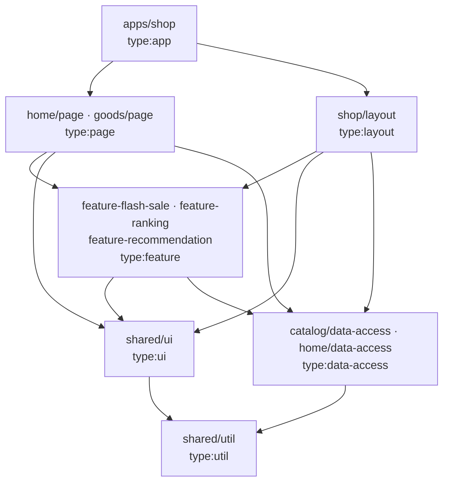

# 架構說明

> 這份文件描述「系統現在長什麼樣、為什麼這樣切、規模變大時怎麼管」。
> 設計有變動時**先改這份文件再改 code**。決策的來龍去脈在 [`adr/`](./adr)，設計過程的原始筆記在 [`MoMO面試/`](./MoMO面試)。
>
> 三者的分工：**本文件**說明結構；**ADR** 說明每個決策為什麼這樣選、代價是什麼；**OpenSpec** 說明系統**對外可觀察的行為** —— [`openspec/specs/`](../openspec/specs) 是已實作的現況，[`openspec/changes/build-storefront-pages/`](../openspec/changes/build-storefront-pages) 是待實作的部分，每條 requirement 都附可直接轉成測試的 scenario。判斷「實作對不對」時以 OpenSpec 為準。

## 1. 範圍

| 做                                                                           | 不做（見 README 的 Known Gaps）                                       |
| ---------------------------------------------------------------------------- | --------------------------------------------------------------------- |
| `/` 首頁：固定於頂端的 TopBar → Header → 可展開分類 → 13 個業務區塊 → Footer | 搜尋（搜尋框純展示）、`/search` `/live` `/discover`                   |
| `/goods/:goodsId`：左商品圖、右標題與商品說明、三顆按鈕、Footer              | **詳情頁任何互動**：三顆按鈕只渲染、不綁行為                          |
| 只有商品卡可點 → 進詳情頁                                                    | Banner 不可點、右側浮動欄、登入、購物車、結帳                         |
| 「你可能會喜歡」3 列後出現「看更多」                                         | RWD（Desktop-first，固定容器寬 1220px）；商品名稱與價格為生成的假資料 |

目標畫面的截圖在 [`pictures/`](./pictures)（依頁面由上到下編號）。

## 2. 設計原則

1. **依賴方向單向，且由 lint 強制**，不靠自律：`app → layout / page → feature → ui / data-access → util`。
2. **Package 依職責切分，並有明確的共用門檻**（見 §5 的 Rule of Two 與粒度準則）。
3. **首頁是資料驅動的**：區塊順序與內容來自 `HomeSection[]`，不是寫死在 JSX。
4. **框架耦合集中在一處**：`react-router` 只准出現在 `apps/shop`，`embla` 只准出現在 `packages/shared/ui`。換 SSR 框架或換輪播套件是單一專案的修改。
5. **資料走 Repository 接縫 + Context 注入**：UI 只認 hooks，hooks 只認 interface；用哪個實作由 composition root（`apps/shop` 的 providers）決定。
   - 連帶規則：**`shared/ui` 不認識 domain model**。元件只宣告自己需要的最小形狀（例：`ProductCardItem`），domain 的 `Product` 靠 structural typing 直接傳入，雙方零 import。

## 3. 分層與依賴規則



| `type:`       | 可依賴                                       | 職責                                                                                                      |
| ------------- | -------------------------------------------- | --------------------------------------------------------------------------------------------------------- |
| `app`         | layout, page, feature, ui, data-access, util | 薄殼 + **composition root**：router、providers、注入 Link 與 repository 實作                              |
| `layout`      | feature, ui, data-access, util               | 跨頁保留的外框。與 `page` 同層：由 router 巢狀組合，**layout ✗ page、page ✗ layout**；只有 `app` 能依賴它 |
| `page`        | feature, ui, data-access, util               | 把多個 feature 組合成一頁。**只有 `layout` 與 `page` 能同時 import 多個 feature**                         |
| `feature`     | ui, data-access, util                        | 有邏輯的業務區塊（smart component）。**feature ✗ feature**                                                |
| `ui`          | ui, util                                     | 純展示元件。不碰資料、不碰 router、不認識 domain model                                                    |
| `data-access` | util                                         | 型別、repository interface 與實作、query hooks、fixtures。**data-access ✗ data-access**                   |
| `util`        | util                                         | 純函式                                                                                                    |

Nx 文件只列四種 type：feature、ui、data-access、util。**`page` 與 `layout` 是我們自訂的延伸**，兩者合起來是「路由層級的組合」這一層。為什麼這樣分、比較過哪些放法（包含 Nx 社群的 `feature-shell`），見 [ADR-0007](./adr/0007-layout-as-a-lib-and-a-tier.md)。

`scope:` 規則（domain 之間誰能依賴誰，治理方式見 [ADR-0006](./adr/0006-domain-dependency-map.md)）：

| scope     | 可依賴的 scope         |
| --------- | ---------------------- |
| `home`    | home, catalog, shared  |
| `goods`   | goods, catalog, shared |
| `shop`    | shop, catalog, shared  |
| `catalog` | catalog, shared        |
| `shared`  | shared                 |

`shop` 是「整個店面共用、但不是通用工具」的 scope，與 `apps/shop` 同名；目前只有外框。它和 `shared` 的差別：`shared` 不能依賴任何 domain，而外框需要 `catalog` 的分類資料。

一個專案必須**同時**滿足自己的 `type:` 與 `scope:` 限制。`apps/shop` 只有 `type:app`，所以能組合所有 scope。

### 怎麼強制、怎麼驗證

- 規則寫在根目錄 [`eslint.config.mjs`](../eslint.config.mjs)：`@nx/enforce-module-boundaries`（7 條 type + 5 條 scope）與 `no-restricted-imports`。tags 宣告在各專案 `package.json` 的 `nx.tags`。
- `no-restricted-imports` 採「預設全禁、單點放行」：根設定兩個套件都禁，`apps/shop` 與 `packages/shared/ui` 在**自己的** eslint 設定用 `restrictedImports([...])` 明確放行 —— 例外寫在它生效的地方。
- **package 的「私有」由兩道關卡保證**（都實際放入違規樣本驗證過）：每個 package 的 `package.json` 的 `exports` 只公開 `.`（即 `src/index.ts`），所以以「套件名稱 + 內部路徑」引用會在**型別檢查**失敗（TS2307）；以相對路徑跨專案引用會被 **lint** 擋下。沒有從 `index.ts` 匯出的東西就是 package 私有的。因為兩道關卡來自不同工具，驗證時 `lint` 與 `typecheck` 都要跑。
- **package 只能用自己宣告的依賴**：`@nx/dependency-checks` 比對每個 `package.json` 與該專案 `src/` 的 import —— 少宣告、多宣告都是 lint 錯誤。這條規則有兩個陷阱，都實際踩到：(1) 專案若沒有 `buildTargets` 所列的 target，它**靜默地什麼都不檢查**，而預設值 `['build']` 只有 app 有，所以改用每個專案都有的 `typecheck`；(2) 它只看得到明寫的 import，只寫 JSX、沒有 `import … from 'react'` 的 package 會被誤判為沒用到 react —— 這種 package 在自己的 eslint 設定裡對 react 單點放行。
- **樣式的跨 package 引用由 build 把關**：ESLint 不讀 CSS，所以 `@import` 以相對路徑伸進別的 package 時 lint 不會報錯；改由 `exports` 把關 —— 沒有公開的路徑在 build 時失敗（`"./…" is not exported`）。
- **跨專案 import 要先宣告依賴**：在自己的 `package.json` 加上 `"@momo/<package>": "workspace:*"`，執行 `pnpm install` 與 `nx sync`（更新 TypeScript project references）。pnpm 的嚴格 `node_modules` 不會解析未宣告的 workspace 套件 —— 依賴必須明說。
- **這些規則被驗證過會擋，而不只是存在**：建立時放入 5 個故意違規的探針檔（feature→feature、ui→data-access、scope:goods→scope:home、package 內 import router、`shared/ui` 以外 import embla），全部被 lint 擋下；2 個合法的對照組通過。新增 `layout` 層時再放入 5 個：改規則前 layout→feature 被擋（紅燈），改規則後通過；page→layout、feature→layout、`scope:shop`→`scope:home` 被擋；app→layout 通過。紀錄見 [`agent-workflow.md`](./agent-workflow.md)。
- **lint 回答不了的問題由 [`tools/verify-boundaries.mjs`](../tools/verify-boundaries.mjs) 回答**（`pnpm verify:boundaries`）：
  1. 每個專案的 tags 格式正確、恰好一個 `type:`、package 恰好一個 `scope:`、且都是 private。**tags 寫壞的 package 會靜默地不受任何規則約束，而 lint 依然是綠的** —— 這個錯誤在建立 package 時真的發生過。
  2. 每個專案**實際解析出來的** ESLint 設定裡，boundary 規則是 `error`、限制條數一致；只有 `shop` 能 import router、只有 `shared-ui` 能 import embla；`@nx/dependency-checks` 是 `error`，**而且專案真的有它所依賴的 target**（否則它開著卻什麼都不檢查）。
  3. Nx project graph 裡每一條專案間的依賴，逐條比對限制。

  限制是從有效的 ESLint 設定讀出來的，沒有第二份要同步。這支腳本本身也被驗證過會報紅：故意把一個 package 的 tags 改壞，它以 exit 1 指出是哪個 package、什麼問題。

## 4. Workspace 結構（1 app + 10 packages）

Nx 23、pnpm workspaces、TypeScript project references。每個專案都是一個 pnpm workspace package：`@momo/*` 能被 import，是因為 pnpm 依它的 `package.json` 建立連結（舊版 Nx 靠 `tsconfig` 的 `paths`，那時的 lib 才沒有 `package.json`）。所以資料夾叫 `packages/`，不叫 `libs/`。決策與比較見 [ADR-0008](./adr/0008-packages-not-libs.md)。

```
apps/shop                              @momo/shop                            type:app
packages/shared/ui                         @momo/shared-ui                       type:ui           scope:shared
packages/shared/util                       @momo/shared-util                     type:util         scope:shared
packages/catalog/data-access               @momo/catalog-data-access             type:data-access  scope:catalog
packages/catalog/feature-recommendation    @momo/catalog-feature-recommendation  type:feature      scope:catalog
packages/home/data-access                  @momo/home-data-access                type:data-access  scope:home
packages/home/feature-flash-sale           @momo/home-feature-flash-sale         type:feature      scope:home
packages/home/feature-ranking              @momo/home-feature-ranking            type:feature      scope:home
packages/home/page                         @momo/home-page                       type:page         scope:home
packages/goods/page                        @momo/goods-page                      type:page         scope:goods
packages/shop/layout                       @momo/shop-layout                     type:layout       scope:shop
```

每個 package 的 README 寫明它的職責、可依賴的層、以及 `src/index.ts` 是唯一公開 API。

**一個 package 要遵守的四件事**（pnpm 與 Nx 對 package 的慣例，見 ADR-0008）：

1. **分組資料夾只是資料夾**：`packages/<scope>/<name>`，`<scope>` 那一層沒有 `package.json`；workspace glob 是 `packages/*/*`，不用 `**`。package 名稱固定是 `@momo/<scope>-<name>`。
2. **`exports` 是唯一的入口**：TypeScript 走 `.`；其他種類的檔案也一樣 —— 設計 token 的樣式由 `@momo/shared-ui` 以 `./theme.css` 公開，app 寫 `@import '@momo/shared-ui/theme.css'`，不以相對路徑伸進別的 package。
3. **import 什麼就宣告什麼**：`src/` 用到的外部套件寫在自己的 `dependencies`，版本一律是 `catalog:`，實際版本只寫在 `pnpm-workspace.yaml` 的 `catalog`（整個 workspace 同一個版本）；同 workspace 的 package 用 `workspace:*`。
4. **共用的工具留在根目錄**：測試與建置工具（vitest、testing-library、vite、eslint、typescript、nx）只宣告在根目錄的 `package.json`，spec 檔與設定檔的 import 不算在第 3 點內。

文件裡的「package」指 app 以外的專案。`lib` 這個字只出現在 Nx 的專有名詞裡：`@nx/react:lib` generator、`tsconfig.lib.json`（`nx.json` 與 `nx sync` 依賴的檔名）、Nx 專案類型 `lib`。

兩個值得說明的切分決定：

- **`home/data-access` 與 `catalog/data-access` 分開**：首頁版位（CMS）與商品目錄（Catalog）在真實電商是兩個不同的後端來源。兩者只靠 `collection` 字串 key 鬆耦合、互不 import —— 混在一起之後最難拆。
- **`feature-recommendation` 放在 `catalog` 而不是 `home`**：真實網站的商品詳情頁也有「你可能會喜歡」。放在 `home` 的話 `goods/page` 依 scope 規則拿不到它。

## 5. Package 的內部結構、共用門檻與粒度準則

### 內部結構（layout / page / feature package 一致）

```
src/
├─ index.ts        只匯出 container —— package 的公開 API
├─ <name>.tsx      container：抓資料 + 組合
├─ ui/             私有展示元件（不匯出）
└─ model/          私有邏輯與 hooks（不匯出）
```

Nx 的 generator 會把程式碼放在 `src/lib/` 底下，這一層已經拿掉：在 npm 生態裡 `lib/` 傳統上是「編譯後的產物」，package 的慣例是原始碼在 `src/`、產物在 `dist/`；而且那一層不帶任何意義。

測試檔 `*.spec.ts(x)` 與原始碼同層。

### Rule of Two（共用門檻）

元件或函式**被 ≥2 個專案（package 或 app）使用**，才能進 `shared/ui`、`shared/util`。只有自己用的，留在該 package 的 `ui/` 或 `model/`。

升級路徑：package 私有 → 出現第 2 個使用者 → 只在同 domain 共用就升到 `packages/<scope>/ui`，跨 domain 才升到 `shared/ui`。因為 lint 禁止 deep import 與 feature ✗ feature，想偷用別人的私有元件會直接報錯 —— **升級是被工具逼出來的**。

例：「看更多」按鈕與展開邏輯只有 recommendation 用 → 留在 `feature-recommendation/ui`；倒數計時只有 flash-sale 用 → 留在 `feature-flash-sale`。

### 粒度準則：什麼時候拆 package、什麼時候不拆

`packages/` 變大不是問題 —— 它就是 `src/`，程式碼總要有地方放。**要防的是單一 package 變肥。** 成長的方式應該是「新增 scope」，而不是「養大既有的 package」。

**該拆**（符合任一項）：負責的人或團隊不同｜變動頻率明顯不同｜是 lazy-load 的邊界｜會被第 2 個地方重用｜有自己的資料來源。

**不該拆**：不要每個 URL 一個 page package（一個 domain 的路由群共用一個）｜不要每個元件一個 package｜沒有邏輯的純版面區塊不拆（首頁的 CMS blocks 就留在 `home/page`）。每個 package 約有 8 個設定檔的固定成本，空殼 package 只有成本沒有收益。

**已知會先變肥的三個地方與拆分觸發條件：**

| Package               | 風險                                                              | 觸發條件 → 動作                                                                                 |
| --------------------- | ----------------------------------------------------------------- | ----------------------------------------------------------------------------------------------- |
| `catalog/data-access` | 目前同時放商品、分類、限時搶購、暢銷榜、推薦                      | 出現第 2 種促銷型別，或促銷有自己的後端 → 抽 `promotion/data-access`                            |
| `shared/ui`           | 全專案都依賴它；長大後任何修改都讓 `nx affected` = 全部，快取失效 | 元件超過約 15 個，或 affected 雜訊明顯 → 依元件家族拆（`shared/ui-product`、`shared/ui-form`…） |
| scope 放行清單        | scope 變多後，遇到 lint 錯誤就「加一個放行」，最後誰都能依賴誰    | 新增任何 scope 放行前必須先更新 [ADR-0006](./adr/0006-domain-dependency-map.md)                 |

### Layout：跨頁保留的外框

TopBar、主 header、分類列與 footer 屬於 **layout**，不屬於任何一頁。它們在每一條路由都存在，換頁時不會重新掛載。

```
RouterProvider
└─ LayoutRoute（沒有 path 的 layout route）        apps/shop/src/app/router.tsx
   └─ <AppLayout>                                   packages/shop/layout
      ├─ TopBar          fixed；主 header 捲出視窗後轉為 compact 並顯示搜尋框
      ├─ MainHeader      logo（連回首頁）+ 搜尋框（展示用）
      ├─ CategoryNav     橫向分類列 + 可展開的「選擇分類」面板
      ├─ <main> <Outlet /> </main>                  ← 只有這裡隨路由替換
      └─ Footer
```

- **機制**：`AppLayout` 掛在一條沒有 path 的 layout route 上，`/`、`/goods/:goodsId`、找不到頁面都是它的子路由，頁面內容透過 `<Outlet />` 換進去。路由的概念只存在於 `apps/shop`；`packages/shop/layout` 只拿到 `children`，不知道 router 的存在。
- **驗證**：`router.spec.tsx` 對三條路由都檢查 `banner`、`main`、`contentinfo` 三個 landmark 都在（規格 `app-layout`「每個頁面都有共用外框」）。
- **layout 只決定頁面放哪裡，不決定頁面多寬**：`<main>` 沒有寬度與留白。首頁是滿版的灰底、上面疊 1220px 的白色區帶；詳情頁是 1220px 的單欄 —— 這是各頁自己的事。原本 `<main>` 替每一頁套上 1220px + padding，做首頁時才發現放不下滿版的底色，於是把容器的責任移到頁面（Step 8）。
- **層級**：layout 是 `type:layout`，與 `page` 同層（§3）。只有 `apps/shop` 的 router 能 import 它；page 與 feature import 它都是 lint 錯誤。它可以組合 feature，所以日後 header 裡由別的 domain 擁有的互動元件（mini-cart、搜尋自動完成）能以 feature 的形式放進來，而不必把對方的邏輯寫進外框。摘要資料（購物車數量、登入狀態）則直接讀對方的 `data-access`。見 [ADR-0006](./adr/0006-domain-dependency-map.md)。
- **為什麼整個 layout 放在 package 而不是 `apps/shop/src/layouts`**：Nx 官方的兩個範例都把 layout 外框放在 app、只把可重用的零件抽成 package，所以這是一個需要說明的選擇。比較與理由見 [ADR-0007](./adr/0007-layout-as-a-lib-and-a-tier.md)；簡短地說，app 是唯一不受邊界規則約束的專案，所以只放接線。
- **加第二種 layout**（例：結帳流程用沒有分類列、精簡 footer 的外框）：新增 `packages/checkout/layout`（`type:layout`），在 router 再掛一條 layout route 指向它，把結帳的路由放到它底下。現有的 `AppLayout` 與頁面都不用改。
- **命名**：這個 package 改過兩次名，兩次都是 Human 提出質疑後才改的。(1) `shell/feature` → `layout/feature`：它就是一般所說的 layout，而「shell library」在 Nx 社群另有所指（串接某個 domain 路由的進入點 lib），沿用會讓熟悉 Nx 的讀者誤判用途。(2) `layout/feature` → `shop/layout`：路徑的寫法是 `packages/<誰的>/<哪一種>`，「layout」是種類而不是擁有者，放在 scope 的位置讀起來是「layout 的 feature」，說不通；第一次改名只換了字，沒有檢查換完之後整條路徑還通不通。

### 設計 Token

顏色、字級、圓角、陰影走兩層 token：**Primitive**（有哪些顏色，元件不可用）→ **Semantic**（用在哪裡，元件唯一能用的一層）。Tailwind 預設的色盤與字級被關閉，所以不是 token 的顏色用不了。數值從真實網站的計算樣式量出。詳見 [`design-tokens.md`](./design-tokens.md)。

## 6. 首頁：config-driven

```ts
// 不可點。width / height 是圖的原始尺寸，讓瀏覽器在圖到之前先留好位置
type Banner = {
  id: string;
  imageUrl: string;
  alt: string;
  width: number;
  height: number;
  caption?: string;
};
type Shortcut = { id: string; iconUrl: string; label: string };
type SectionTitle = { lead?: string; text: string }; // lead：標題前半較淺的字（「降價」+「好貨」）

type HomeSection =
  | {
      id: string;
      type: 'hero';
      banners: Banner[];
      aside: { title: string; items: Banner[] };
    }
  | {
      id: string;
      type: 'banner-carousel';
      title?: SectionTitle;
      label: string;
      perView: number;
      gap: number;
      banners: Banner[];
    }
  | {
      id: string;
      type: 'banner-grid';
      title?: SectionTitle;
      label: string;
      columns: number;
      banners: Banner[];
    }
  | { id: string; type: 'shortcut-bar'; items: Shortcut[] }
  | { id: string; type: 'notice'; banner: Banner }
  | {
      id: string;
      type: 'product-rail';
      title: SectionTitle;
      collection: string; // CMS 只給 key，商品由 catalog 提供
      card: 'vertical' | 'horizontal';
      perView: number;
    }
  | { id: string; type: 'flash-sale'; title: SectionTitle } // ↓ 三個交給 feature package，自己抓資料
  | { id: string; type: 'ranking'; title: SectionTitle }
  | { id: string; type: 'recommendation'; title: SectionTitle };
```

```
HomePage            useHomeLayout() → 載入中 / 載入失敗 / <SectionRenderer>
└─ SectionRenderer  純元件：sections + registry → 依序渲染；未知 type 略過並回報
   └─ SECTION_REGISTRY
      ├─ 6 個 page 私有的 block      hero · banner-carousel · banner-grid · shortcut-bar · notice · product-rail
      └─ 3 個 feature 的轉接         flash-sale · ranking · recommendation（feature 只收 { title, lead? }）
```

- `SectionRegistry` 是對 union 的 mapped type：union 新增型別卻沒註冊元件 → **編譯期報錯**（實際驗證：暫時加入 `video-wall` → `TS2741: Property '"video-wall"' is missing`）。每個元件拿到的正好是自己那一種 section。
- 執行期遇到未知 type（CMS 先上了新區塊）→ 該區塊略過、其餘照常、呼叫 `reportError`。回報放在 effect 裡並以「未知區塊的清單」為 key，所以是**一次**，不是每次 render 一次。查表用 `Object.hasOwn`：`registry['constructor']` 在每個物件上都存在。
- `SectionRenderer` 是純元件，registry 由 props 傳入，所以它的測試用「每種 type 一行」的假元件，測的是分派與順序，不牽涉任何 block。抓資料只在 `HomePage`。
- **錯誤回報集中在 app 的 QueryCache**：每個失敗的查詢由 `createQueryClient()` 回報一次、帶上 query key。頁面只負責顯示狀態，不會漏報也不會重複報。
- **一個 block 撐起 5 個區塊**：官方優惠圖示、品牌折扣、信用卡加碼、猜你想搜、moPro 都是 `banner-carousel`，差別只在資料（一次幾張、間距、有沒有說明文字）。
- **版面數值放在資料裡**（`perView`、`gap`、`columns`）：這是 config-driven 的代價之一 —— CMS 要懂一點版面。數值都是在真站 1220px 版面量到的，實作後再到瀏覽器對過一次（hero 327×445、圖示 148.5、品牌磚 218.8×365、信用卡 250×125、猜你想搜 186×234）。
- 商品列拿到的是 collection key，商品由 catalog 提供，所以卡片與它連到的詳情頁不可能對不起來。商品列載入失敗時自己消失，不拖垮整頁；載入中先保留高度，下面的區塊不會跳動。

13 個業務區塊對應 15 筆 section 設定（官方優惠拆成 3 筆），只需要 9 種 renderer。調整區塊順序、上下架區塊都只改資料（實際驗證：調換 `home-layout.ts` 的兩筆，畫面上兩個區塊跟著對調，沒有動任何元件）。對照表見 [設計筆記 §5](./MoMO面試/Phase%201%20—%20%20Design%20and%20Planning.md)。

`apps/shop` 有一個 spec 檢查版位資料指到的每一張圖都存在於 `public/`（60 多個路徑）：資料和檔案之間沒有別的東西把它們綁在一起，打錯字只會在瀏覽器裡變成破圖。放在 app 是因為檔案由 app 提供。

### 商品詳情頁

```
goods.route.tsx（app）   useParams → <GoodsDetailPage goodsId />      讀網址是 app 的事
└─ GoodsDetailPage       useProduct(goodsId) → 載入中 / 載入失敗 / 找不到商品 / 頁面
   └─ 私有的 ui/         goods-gallery · goods-info · goods-actions · goods-not-found
```

- **展示用是決定，不是沒做完。** 三顆按鈕沒有 `onClick`、不導頁、不改狀態、不發請求。理由寫在 `goods-actions.tsx` 的註解，並由一個 spec 守住：每顆按鈕點兩次，比較點擊前後的頁面 HTML、網址、history 長度與 repository 被呼叫的次數。要接上行為，得先改這個 spec —— 也就是得是刻意的。
- **和首頁讀同一份商品表**（`useProduct`）。app 的整合測試從首頁的商品卡點進詳情頁，檢查標題與售價一致。
- **「找不到」是答案，不是錯誤**：`useProduct` 回 `null` → 顯示提示與回首頁的連結，外框照常。
- 價格照真站詳情頁的寫法（「促銷價 50,200 元」，沒有 `$`），所以沒有重用商品卡的 `PriceTag`。主圖的 `alt` 是商品名稱：在這一頁它是內容，不是裝飾。

## 7. 資料層

```ts
interface CatalogRepository {
  getProduct(id: string): Promise<Product | null>;
  getCollection(key: string): Promise<Product[]>; // 未知 key → []
  getRecommendations(p: {
    offset: number;
    limit: number;
  }): Promise<Page<Product>>;
  getFlashSale(): Promise<{ endsAt: string; items: FlashSaleItem[] }>;
  getRanking(): Promise<Product[]>;
  getCategories(): Promise<Category[]>;
}
```

- `createMockCatalogRepository({ data, now, latencyMs })` 在 composition root 建立並以 Context 注入；hooks 透過 `useCatalogRepository()` 取得。「查不到」是一種答案而不是失敗：回 `null` 或 `[]`，不 throw。
- `getFlashSale().endsAt` = `now() + N 小時`，不寫死在 fixture（否則倒數會過期）。
- **一份商品表，集合只存 id**：同一個商品 id 會出現在好幾個區塊的素材裡（例：同時在限時搶購、暢銷榜、你可能會喜歡）。所以「首頁與詳情頁的名稱與售價一致」是結構上保證的。
- **`Category` 只有 `id` 與 `name`**：真站「選擇分類」面板的五種底色是「第幾列」決定的（每列 9 個），那是版面的事，由 `shop/layout` 依位置算出，不進資料層。
- **測試的兩種資料來源**：邏輯測試注入小而可控的資料（repository 的 `data` 選項，或 UI 測試用的 fake repository），不依賴真 fixture 的內容與筆數；另有一組測試專門對真 fixture 檢查規格寫明的數字（55 件推薦、40 個分類）。
- **`home/data-access` 是同一個形狀**：`HomeRepository` interface、`createMockHomeRepository({ layout, latencyMs })`、Context、`useHomeLayout`、`./testing` 入口。它和 catalog 刻意分開 —— 正式環境裡版位來自 CMS、商品來自商品服務 —— 兩者只靠一個 collection key 字串相連，互不 import。
- **測試用的入口有三個**：`@momo/catalog-data-access/testing`、`@momo/home-data-access/testing`（fake repository + provider），以及 `@momo/shared-ui/testing`（`installCarouselTestEnvironment()`：jsdom 缺少輪播套件需要的 `ResizeObserver`、`IntersectionObserver` 與 `matchMedia`；擁有那個套件的 package 也擁有這個補丁）。
- **`@momo/catalog-data-access/testing`**：`exports` 的第二個入口，提供 `createFakeCatalogRepository`（每個方法都回「沒有東西」，測試只覆寫它在意的）與 `CatalogTestProvider`。獨立成入口，測試工具才不會進到 app 的 bundle（build 後實際檢查過）。

### 素材與 fixtures 的兩支工具

| 工具                                                 | 做什麼                                                                                                                                  | 怎麼知道它做對了                                                                                                                                                                             |
| ---------------------------------------------------- | --------------------------------------------------------------------------------------------------------------------------------------- | -------------------------------------------------------------------------------------------------------------------------------------------------------------------------------------------- |
| `node tools/import-assets.mjs <素材根目錄>`          | 把素材複製到 `apps/shop/public/assets/`，中文資料夾與檔名對應到 ASCII slug。對照表就在腳本裡，是每個素材出處的紀錄                      | **每個來源檔案都必須有交代**（複製，或因為明確的理由略過），否則以 exit 1 結束。第一次盤點漏掉的巢狀資料夾就是這樣被抓到的。另以內容雜湊對帳過：203 個來源檔案，202 個複製、1 個重複下載略過 |
| `node tools/gen-fixtures.mjs`（`pnpm gen:fixtures`） | 由素材產生商品資料：id 取自檔名，名稱、價格、說明由 id 的雜湊決定。不用亂數、不讀時鐘。同一張圖常在多個區塊各給一份，gallery 依內容去重 | `--check`（`pnpm verify:fixtures`）在磁碟上的檔案過期時失敗；連跑兩次逐位元組相同                                                                                                            |

商品 id 是真的（來自檔名），**名稱、品牌與價格是編的，而且品牌刻意用虛構的** —— 產生出來的名稱旁邊那張照片並不是那個商品，不應該看起來像真的商品頁。分類清單是手寫的：它是從真站讀來的，沒有素材可以產生它。

## 8. 測試策略

TDD 只打有邏輯的地方：純函式、repository、分頁與「看更多」、`SectionRenderer` 的降級行為、分類展開、倒數計時、詳情頁的存在 / 不存在兩種狀態。

**刻意不測**：純版面區塊（banner 類）、`use-compact-header`（jsdom 沒有 IntersectionObserver，交給 E2E）。

空的 package 目前設了 `passWithNoTests`。**某個 package 加入第一個 spec 時要把它的這行拿掉**，否則日後測試被誤刪不會有人發現。

## 9. 決策紀錄與演進方向

| ADR                                                          | 決策                                                    | 演進觸發條件                                         |
| ------------------------------------------------------------ | ------------------------------------------------------- | ---------------------------------------------------- |
| [0001](./adr/0001-spa-over-next.md)                          | SPA（Vite）而非 Next                                    | 需要 SEO / LCP                                       |
| [0002](./adr/0002-single-app-with-domain-libs.md)            | 單一 app + domain packages                              | 不同團隊負責不同路由群；需要獨立部署                 |
| [0003](./adr/0003-server-state-only-no-global-store.md)      | 只有 TanStack Query，沒有全域 store                     | 出現購物車、會員                                     |
| [0004](./adr/0004-config-driven-home-page.md)                | 首頁 config-driven                                      | 接 CMS API                                           |
| [0005](./adr/0005-repository-seam-with-context-injection.md) | Repository + Context 注入，而非 MSW                     | 需要 contract test / 網路層模擬                      |
| [0006](./adr/0006-domain-dependency-map.md)                  | Domain 依賴地圖與 scope 放行的治理                      | 新增任何 domain                                      |
| [0007](./adr/0007-layout-as-a-lib-and-a-tier.md)             | 全站 layout 放在 package，並作為自訂的一層              | 同一個應用要出多個平台版本；出現第二個 app           |
| [0008](./adr/0008-packages-not-libs.md)                      | `packages/` 而非 `libs/`，以及 package 的結構與依賴宣告 | 需要把 package 發佈到 registry；出現第二種語言的專案 |
